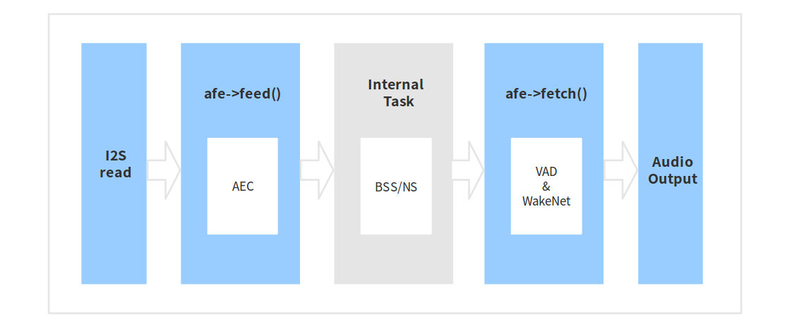

# Audio Front-end Framework[[中文]](./README_CN.md)

Espressif Audio Front-end (AFE) algorithm framework is independently developed by ESPRESSIF AI Lab. Based on ESP32 series chips, the framework can provide high-quality and stable audio data to the host.

---

## Summary

Espressif AFE provides the most convenient way to do audio front-end processing on ESP32 series chips. Espressif AFE framework stably transfers high-quality audio data to the host for further wake-up or speech recognition.

The functions supported in Espressif AFE are as follows:


The workflow of Espressif AFE is as follows:



The workflow of Espressif AFE can be divided into four parts:

- AFE creation and initialization
- AFE feed: Input audio data and will run AEC in the feed function
- Internal BSS, NS algorithms
- AFE fetch: Return the audio data after processing and the output value. the AFE fetch will perform VAD internally. If you configure WakeNet to be 'enabled', WakeNet wil do wake-word detection

**Note:** `afe->feed()` and `afe->fetch()` are visible to users, while `internal BSS task` is invisible to users.

> AEC runs in `afe->feed()` function;  
> BSS is an independent task in AFE;  
> The results of VAD and WakeNet are obtained by `afe->fetch()` function.  

### Select AFE handle

Espressif AFE supports both single MIC and dual MIC scenarios. The internal task of single MIC applications is processed by NS, and the internal task of dual MIC applications is processed by BSS.

- Single MIC

		esp_afe_sr_iface_t *afe_handle = &esp_afe_sr_1mic;

- Dual MIC

		esp_afe_sr_iface_t *afe_handle = &esp_afe_sr_2mic;

### Select AFE mode

- Single MIC

    Espressif AFE single MIC supports 2 working modes: SR_MODE_MONO_LOW_COST, SR_MODE_MONO_MEDIUM_COST.

  - SR_MODE_MONO_LOW_COST
  
    It is suitable for mono audio data + one reference audio data, with very low memory consumption and CPU resource consumption. It runs less-complex AEC and less-complex mono NS algorithm.

  - SR_MODE_MONO_MEDIUM_COST

    It is suitable for mono audio data + one reference audio data, with low memory consumption and CPU resource consumption. It runs less-complex AEC and medium-complex mono NS algorithm.


- Dual MIC

    Espressif AFE dual MIC supports 3 working modes: SR_MODE_STEREO_LOW_COST, SR_MODE_STEREO_MEDIUM, SR_MODE_STEREO_HIGH_PERF.

   - SR_MODE_STEREO_LOW_COST

    It is suitable for two-channel audio data + one reference audio data, it runs less-complex AEC and less-complex BSS.

  - SR_MODE_STEREO_MEDIUM

    It is suitable for two-channel audio data + one reference audio data, it runs high-complexity AEC and less-complex BSS.

  - SR_MODE_STEREO_HIGH_PERF

    It is suitable for two-channel audio data + one reference audio data, it runs high-complexity AEC and high-complexity BSS.

### Input Audio data

- AFE single MIC

   - Input audio data format: 16KHz, 16bit, two channels (one is mic data, another is reference data)
   - The data frame length is 16ms. Users can use `afe->get_feed_chunksize()` to get the number of sampling points needed (the data type of sampling points is int16).

  **Note**: the number of sampling points got by `afe->get_feed_chunksize()` is just the data of one channel.

 The input data is arranged as follows:

   

- AFE dual MIC

   - Input audio data format: 16KHz, 16bit, three channels (two are mic data, another is reference data)
   - The data frame length is 16ms. Users can use `afe->get_feed_chunksize()` to get the number of sampling points needed (the data type of sampling points is int16).

  The input data is arranged as follows:

      


### AEC Introduction

The AEC (Acoustic Echo Cancellation) algorithm supports maximum two-channel processing, which can effectively remove the echo in the mic input signal, and help with further speech recognition.

### NS (noise suppression)

NS algorithm supports single-channel processing and can suppress the non-human noise in single-channel audio, especially for steady noise.

### BSS (Blind Source Separation)

BSS algorithm supports dual-channel processing, which can well separate the target sound source from the rest of the interference sound, so as to extract the useful audio signal and ensure the quality of the subsequent speech.

### VAD (Voice Activity Detection)

VAD algorithm supports real-time output of the voice activity state of the current frame.

### WakeNet or Bypass

Users can choose whether to detect wake words in AFE. When calling `afe->disable_wakenet(afe_data)`, it will enter bypass mode, and the WakeNet will not run.

### Output Audio

The output audio of AFE is single-channel data. When WakeNet is enabled, AFE will output single-channel data with human voice.

---

## Quick Start

### 1. Define afe_handle

`afe_handle` is the handle of AFE operation. Users need to select the corresponding AFE handle according to the single MIC and dual MIC applications.

- Single MIC

	    esp_afe_sr_iface_t *afe_handle = &esp_afe_sr_1mic;

- Dual MIC

	    esp_afe_sr_iface_t *afe_handle = &esp_afe_sr_2mic;

### 2. Create afe_handle

Use `afe_handle->create()` function to initialize the AFE created in step1.

```
typedef esp_afe_sr_data_t* (*esp_afe_sr_iface_op_create_t)(afe_sr_mode_t mode, int perferred_core);

- param mode              The mode of AFE_SR 
- param perferred_core    The perferred core to be pinned for BSS Task. 
- returns Handle to the AFE_SR data
```

There are two parameters used as above. Users can set different AFE modes and the number of CPU cores for BSS task in AFE according to the actual application requirements.

**Note**: ESP32 audio development board, such as ESP32-Lyrat_Mini, AFE mode can only select `SR_MODE_MONO_LOW_COST` or `SR_MODE_MONO_MEDIUM_COST`.

### 3. Set WakeNet

Two steps to set up WakeNet:

- Use `make menuconfig` to choose WakeNet model. Please refer to: [WakeNet](https://github.com/espressif/esp-sr/tree/b9504e35485b60524977a8df9ff448ca89cd9d62/wake_word_engine)  
- Call `afe_handle->set_wakenet(afe_data, &WAKENET_MODEL, &WAKENET_COEFF);` to initialize WakeNet.

### 4. feed audio data

After initializing AFE and WakeNet, users need to input audio data into AFE by `afe->feed()` function for processing.

The input audio size and layout format can refer to the step **Input Audio data**.

```
typedef int (*esp_afe_sr_iface_op_feed_t)(esp_afe_sr_data_t *afe, const int16_t* in);

- param afe   The AFE_SR object to queryq
- param in    The input microphone signal, only support signed 16-bit @ 16 KHZ. The frame size can be queried by the `get_samp_chunksize`. The channel number can be queried `get_channel_num`.
- return      The size of input

```

Get the number of audio channels:

 `afe->get_channel_num()` function can provide the number of MIC data channels that need to be put into `afe->feed()` function（ Without reference channel).

```
typedef int (*esp_afe_sr_iface_op_get_channel_num_t)(esp_afe_sr_data_t *afe);
- param afe The AFE_SR object to query
- return The amount of samples to feed the fetch function
```

### 5. fetch audio data

Users can get the processed single-channel audio by `afe->fetch()` function.

The number of data sampling points of fetch (the data type of sampling point is int16) can be got by `afe->get_fetch_chunksize`.

```
typedef int (*esp_afe_sr_iface_op_get_samp_chunksize_t)(esp_afe_sr_data_t *afe);
- param afe The AFE_SR object to query
```

Please pay attention to the return value of `afe->fetch()`:  
- -1: noise
- 0: speech
- 1: wake word 1
- 2: wake word 2
- ...

```
typedef int (*esp_afe_sr_iface_op_fetch_t)(esp_afe_sr_data_t *afe, int16_t* out);
- param afe   The AFE_SR object to query
- param out   The output enhanced signal. The frame size can be queried by the `get_samp_chunksize`.
- return      The style of output, -1: noise, 0: speech, 1: wake word 1, 2: wake word 2, ...
```

### 6. Usage of WakeNet  

WakeNet in AFE can be used in three ways:

- No WakeNet

Users can choose not to initialize WakeNet if not call:

	afe_handle->set_wakenet(afe_data, &WAKENET_MODEL, &WAKENET_COEFF);

- Use WakeNet  

Users need to configure the wake word by `make menuconfig` first. Then call:  

	afe_handle->set_wakenet(afe_data, &WAKENET_MODEL, &WAKENET_COEFF);

In this way, you can use `afe->fetch()` to check wake-up status.

- Disable WakeNet after wake-up:

When users need to perform other operations after wake-up, such as offline or online speech recognition, they can pause the operation of WakeNet to reduce the CPU resource consumption.

Users can call `afe->disable_wakenet(afe_data)` to stop WakeNet, or call `afe->enable_wakenet(afe_data)` to enable WakeNet.

### 7. Usage of AEC

The usage of AEC is similar to that of WakeNet. Users can disable or enable AEC according to requirements.

- Disable AEC

	afe->disable_aec(afe_data);

- Enable AEC

	afe->enable_aec(afe_data);

