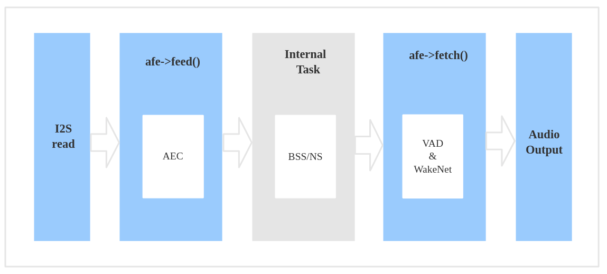
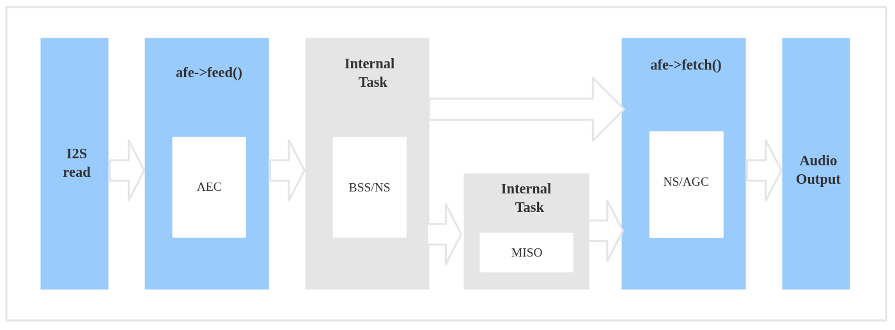
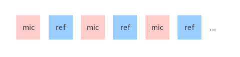
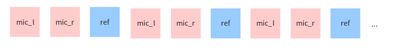

# Audio Front-end 框架[[English]](./README.md)

乐鑫 Audio Front-end(AFE) 算法框架由乐鑫 AI 实验室自主开发。该框架基于 ESP32 系列芯片，能够提供高质量并且稳定的音频数据。

---

## 概述

乐鑫 AFE 框架以最便捷的方式基于乐鑫的 ESP32 系列芯片进行语音前端处理。使用乐鑫 AFE 框架，您可以获取高质量且稳定的音频数据，从而更加方便地构建唤醒或语音识别等应用。

乐鑫 AFE 的功能分为两套：1）针对语音识别场景；2）针对语音通话场景。如下所示：

- 语音识别场景


- 语音通话场景


乐鑫 AFE 的数据流也相应分为两种场景，如下所示：

- 语音识别场景



工作流程如下：

1) 使用 **ESP_AFE_SR_HANDLE**，进行AFE 的创建和初始化 (`voice_communication_init`需配置为 false )
2) AFE feed，输入音频数据，feed 内部会先进行 AEC 算法处理
3) 内部: 进行 BSS/NS 算法处理
4) AFE fetch，返回处理过的单通道音频数据和相关信息， fetch 内部会进行 VAD 处理，以及唤醒词的检测，具体行为取决于用户对 `afe_config_t` 结构体的配置。(注：`wakenet_init` 和 `voice_communication_init` 不可同时配置为 true)

- 语音通话场景



工作流程如下：

1) 使用 **ESP_AFE_VC_HANDLE**，进行AFE 的创建和初始化 (`voice_communication_init`需配置为 true )
2) AFE feed，输入音频数据，feed 内部会先进行 AEC 算法处理
3) 内部: 首先进行 BSS/NS 算法处理；若为双麦，随后还会进行MISO 算法处理；
4) AFE fetch，返回处理过的单通道音频数据和相关信息。其中会进行AGC非线性放大，具体增益值取决于用户对 `afe_config_t` 结构体的配置；若为双麦，在AGC之前还会进行降噪处理。(注：`wakenet_init` 和 `voice_communication_init` 不可同时配置为 true)

**Note:** `afe->feed()` 和 `afe->fetch()` 对用户可见，`Internal BSS/NS/MISO Task` 对用户不可见。

> AEC 在 afe->feed() 函数中运行；若 aec_init 配置为 false 状态，BSS/NS 将会在 afe->feed() 函数中运行。  
> BSS/NS/MISO 为 AFE 内部独立 Task 进行处理；  
> VAD/WakeNet 的结果，以及处理后的单通道音频，通过 afe->fetch() 函数获取。

### 选择 AFE handle

目前 AFE 支持单麦和双麦两种应用场景，并且可对算法模块进行灵活配置。单麦场景内部 Task 为 NS 处理，双麦场景内部 Task 为 BSS 处理，双麦场景若配置为语音通话(即：`wakenet_init=false, voice_communication_init=true`)，则会再增加一个 MISO 的内部 Task。

对于AFE handle的获取，语音识别场景与语音通话场景，略有差异：

- 语音识别

		esp_afe_sr_iface_t *afe_handle = &ESP_AFE_SR_HANDLE;
		
- 语音通话

		esp_afe_sr_iface_t *afe_handle = &ESP_AFE_VC_HANDLE;

### 输入音频

目前 AFE 支持单麦和双麦两种应用场景，可根据 `afe->feed()` 的音频，配置相应的音频通道数。修改方式：在宏 `AFE_CONFIG_DEFAULT()` 中对 `pcm_config` 结构体成员进行配置修改，其支持如下几种配置组合 (注：一定要满足 `total_ch_num = mic_num + ref_num`)：

> total_ch_num=1,  mic_num=1,  ref_num=0
> total_ch_num=2,  mic_num=1,  ref_num=1
> total_ch_num=2,  mic_num=2,  ref_num=0
> total_ch_num=3,  mic_num=2,  ref_num=1

(注解: total_ch_num: 总通道数，mic_num: 麦克风通道数，ref_num: 参考回路通道数)

对于 AEC，目前只支持单回路，故 ref_num 的值只能为 0 或 1

- AFE 单麦场景

	- 输入音频格式为 16KHz, 16bit, 双通道 (1个通道为 mic 数据，另一个通道为参考回路) ; 若不需要 AEC , 音频不包含参考回路，则可只包含1个通道 mic 数据，ref_num 设置为0。
	- 输入数据帧长，会根据用户配置的算法模块不同而有差异, 用户可以使用 `afe->get_feed_chunksize` 来获取需要的采样点数目（采样点数据类型为 int16）
 
 数据排布如下：
 
   

- AFE 双麦场景

	- 输入音频格式为 16KHz, 16bit, 三通道；若不需要 AEC , 音频不包含参考回路，则可只包含两个通道 mic 数据，ref_num 设置为0。
	- 输入数据帧长，会根据用户配置的算法模块不同而有差异, 用户可以使用 `afe->get_feed_chunksize` 来获取需要填充的数据量

 数据排布如下：
 
    

注意：换算成数据量大小为：`afe->get_feed_chunksize * 通道数 * sizeof(short)` 

### AEC 简介

AEC (Acoustic Echo Cancellation) 算法最多支持双麦处理，能够有效的去除 mic 输入信号中的自身播放声音。从而可以在自身播放音乐的情况下进行很好的语音识别等应用。

### NS 简介

NS (Noise Suppression) 算法支持单通道处理，能够对单通道音频中的非人声噪声进行抑制，尤其针对稳态噪声，具有很好的抑制效果。

### BSS 简介

BSS (Blind Source Separation) 算法支持双通道处理，能够很好的将目标声源和其余干扰音进行盲源分离，从而提取出有用音频信号，保证了后级语音的质量。

### MISO 简介

MISO (Multi Input Single Output) 算法支持双通道输入，单通道输出。用于在双麦场景，没有唤醒使能的情况下，选择信噪比高的一路音频输出。

### VAD 简介

VAD (Voice Activity Detection) 算法支持实时输出当前帧的语音活动状态。

### AGC 简介

AGC (Automatic Gain Control) 动态调整输出音频的幅值，当弱信号输入时，放大输出幅度；当输入信号达到一定强度时，压缩输出幅度。

### WakeNet or Bypass 简介

用户可以选择是否在 AFE 中进行唤醒词的识别。当用户调用 `afe->disable_wakenet(afe_data)` 后，则进入 Bypass 模式，AFE 模块不会进行唤醒词的识别。

### 输出音频

AFE 的输出音频为单通道数据。在语音识别场景，若WakeNet 开启的情况下，AFE 会输出有目标人声的单通道数据。在语音通话场景，将会输出信噪比更高的单通道数据。

---

## 快速开始

### 1. 定义 afe_handle

`afe_handle` 是用户后续调用 afe 接口的函数句柄。所以第一步需先获得 `afe_handle`。

- 语音识别

		esp_afe_sr_iface_t *afe_handle = &ESP_AFE_SR_HANDLE;
		
- 语音通话

		esp_afe_sr_iface_t *afe_handle = &ESP_AFE_VC_HANDLE;

### 2. 配置 afe

获取 afe 的配置：

	afe_config_t afe_config = AFE_CONFIG_DEFAULT();

可调整`afe_config`中各算法模块的使能及其相应参数: 

```
#define AFE_CONFIG_DEFAULT() { \
    .aec_init = true, \
    .se_init = true, \
    .vad_init = true, \
    .wakenet_init = true, \
    .voice_communication_init = false, \
    .voice_communication_agc_init = false, \
    .voice_communication_agc_gain = 15, \
    .vad_mode = VAD_MODE_3, \
    .wakenet_model_name = NULL, \
    .wakenet_mode = DET_MODE_2CH_90, \
    .afe_mode = SR_MODE_LOW_COST, \
    .afe_perferred_core = 0, \
    .afe_perferred_priority = 5, \
    .afe_ringbuf_size = 50, \
    .memory_alloc_mode = AFE_MEMORY_ALLOC_MORE_PSRAM, \
    .agc_mode = AFE_MN_PEAK_AGC_MODE_2, \
    .pcm_config.total_ch_num = 3, \
    .pcm_config.mic_num = 2, \
    .pcm_config.ref_num = 1, \
}
```

- aec_init: AEC 算法是否使能。

- se_init: BSS/NS 算法是否使能。

- vad_init: VAD 是否使能 ( 仅可在语音识别场景中使用 )

- wakenet_init: 唤醒是否使能。

- voice_communication_init: 语音通话是否使能。与 wakenet_init 不能同时使能。

- voice_communication_agc_init: 语音通话中AGC是否使能。

- voice_communication_agc_gain: AGC的增益值，单位为dB。

- vad_mode: VAD 检测的操作模式，越大越激进。

- wakenet_model_name: 宏`AFE_CONFIG_DEFAULT()`中该值默认为NULL。使用 `idf.py menuconfig` 选择了相应的唤醒模型后，在调用`afe_handle->create_from_config`之前，需给该处赋值具体的模型名字，类型为字符串形式。唤醒模型的具体说明，详见：[flash_model](../flash_model/README_cn.md)
(注意：示例代码中，使用了 esp_srmodel_filter() 获取模型名字，若 menuconfig 中选择了多个模型共存，该函数将会随机返回一个模型名字)

- wakenet_mode: 唤醒的模式。对应为多少通道的唤醒，根据mic通道的数量选择

- afe_mode: 乐鑫 AFE 目前支持 2 种工作模式，分别为：SR_MODE_LOW_COST, SR_MODE_HIGH_PERF。详细可见 afe_sr_mode_t 枚举。

	- SR_MODE_LOW_COST: 量化版本，占用资源较少。

	- SR_MODE_HIGH_PERF: 非量化版本，占用资源较多。
	
        **ESP32 芯片，只支持模式 SR_MODE_HIGH_PERF;   
        ESP32S3 芯片，两种模式均支持 **

- afe_perferred_core: AFE 内部 BSS/NS/MISO 算法，运行在哪个 CPU 核。

- afe_perferred_priority: AFE 内部 BSS/NS/MISO 算法，运行的task优先级。

- afe_ringbuf_size: 内部 ringbuf 大小的配置。

- memory_alloc_mode: 内存分配的模式。可配置三个值：

	- AFE_MEMORY_ALLOC_MORE_INTERNAL: 更多的从内部ram分配。
	
	- AFE_MEMORY_ALLOC_INTERNAL_PSRAM_BALANCE: 部分从内部ram分配。
	
	- AFE_MEMORY_ALLOC_MORE_PSRAM: 绝大部分从外部psram分配
	
- agc_mode: 将音频线性放大的 level 配置，该配置在语音识别场景下起作用，并且在唤醒使能时才生效。可配置四个值：

	- AFE_MN_PEAK_AGC_MODE_1: 线性放大喂给后续multinet的音频，峰值处为 -5dB。
	
	- AFE_MN_PEAK_AGC_MODE_2: 线性放大喂给后续multinet的音频，峰值处为 -4dB。
	
	- AFE_MN_PEAK_AGC_MODE_3: 线性放大喂给后续multinet的音频，峰值处为 -3dB。
	
	- AFE_MN_PEAK_NO_AGC: 不做线性放大
	
- pcm_config: 根据 `afe->feed()` 喂入的音频结构进行配置，该结构体有三个成员变量需要配置：

	- total_ch_num: 音频总的通道数，total_ch_num = mic_num + ref_num。
	
	- mic_num: 音频的麦克风通道数。目前仅支持配置为 1 或 2。
	
	- ref_num: 音频的参考回路通道数，目前仅支持配置为 0 或 1。

### 3. 创建 afe_data

用户使用 `afe_handle->create_from_config(&afe_config)` 函数来获得数据句柄，这将会在afe内部使用，传入的参数即为上面第2步中获得的配置。

```
/**
 * @brief Function to initialze a AFE_SR instance
 * 
 * @param afe_config        The config of AFE_SR
 * @returns Handle to the AFE_SR data
 */
typedef esp_afe_sr_data_t* (*esp_afe_sr_iface_op_create_from_config_t)(afe_config_t *afe_config);

```

### 4. feed 音频数据

在初始化 AFE 完成后，用户需要将音频数据使用 `afe_handle->feed()` 函数输入到 AFE 中进行处理。

输入的音频大小和排布格式可以参考 **输入音频** 这一步骤。

```
/**
 * @brief Feed samples of an audio stream to the AFE_SR
 *
 * @Warning  The input data should be arranged in the format of channel interleaving.
 *           The last channel is reference signal if it has reference data.
 *
 * @param afe   The AFE_SR object to query
 * 
 * @param in    The input microphone signal, only support signed 16-bit @ 16 KHZ. The frame size can be queried by the 
 *              `get_feed_chunksize`.
 * @return      The size of input
 */
typedef int (*esp_afe_sr_iface_op_feed_t)(esp_afe_sr_data_t *afe, const int16_t* in);

```

获取音频通道数：

使用 `afe_handle->get_total_channel_num()` 函数可以获取需要传入 `afe_handle->feed()` 函数的总数据通道数。其返回值等于AFE_CONFIG_DEFAULT()中配置的 `pcm_config.mic_num + pcm_config.ref_num`

```
/**
 * @brief Get the total channel number which be config
 * 
 * @param afe   The AFE_SR object to query
 * @return      The amount of total channels
 */
typedef int (*esp_afe_sr_iface_op_get_total_channel_num_t)(esp_afe_sr_data_t *afe);
```

### 5. fetch 音频数据

用户调用 `afe_handle->fetch()` 函数可以获取处理完成的单通道音频以及相关处理信息。  

fetch 的数据采样点数目（采样点数据类型为 int16）可以通过 `afe_handle->get_fetch_chunksize` 获取。

```
/**
 * @brief Get the amount of each channel samples per frame that need to be passed to the function
 *
 * Every speech enhancement AFE_SR processes a certain number of samples at the same time. This function
 * can be used to query that amount. Note that the returned amount is in 16-bit samples, not in bytes.
 *
 * @param afe The AFE_SR object to query
 * @return The amount of samples to feed the fetch function
 */
typedef int (*esp_afe_sr_iface_op_get_samp_chunksize_t)(esp_afe_sr_data_t *afe);
```

 `afe_handle->fetch()` 的函数声明如下：

```
/**
 * @brief fetch enhanced samples of an audio stream from the AFE_SR
 *
 * @Warning  The output is single channel data, no matter how many channels the input is.
 *
 * @param afe   The AFE_SR object to query
 * @return      The result of output, please refer to the definition of `afe_fetch_result_t`. (The frame size of output audio can be queried by the `get_fetch_chunksize`.)
 */
typedef afe_fetch_result_t* (*esp_afe_sr_iface_op_fetch_t)(esp_afe_sr_data_t *afe);
```

其返回值为结构体指针，结构体定义如下：

```
/**
 * @brief The result of fetch function
 */
typedef struct afe_fetch_result_t
{
    int16_t *data;                          // the data of audio.
    int data_size;                          // the size of data. The unit is byte.
    int wakeup_state;                       // the value is wakenet_state_t
    int wake_word_index;                    // if the wake word is detected. It will store the wake word index which start from 1.
    int vad_state;                          // the value is afe_vad_state_t
    int trigger_channel_id;                 // the channel index of output
    int wake_word_length;                   // the length of wake word. It's unit is the number of samples.
    int ret_value;                          // the return state of fetch function
    void* reserved;                         // reserved for future use
} afe_fetch_result_t;
```

### 6. WakeNet 使用

当用户在唤醒后需要进行其他操作，比如离线或在线语音识别，这时候可以暂停 WakeNet 的运行，从而减轻 CPU 的资源消耗。  

用户可以调用 `afe_handle->disable_wakenet(afe_data)` 来停止 WakeNet。 当后续应用结束后又可以调用 `afe_handle->enable_wakenet(afe_data)` 来开启 WakeNet。

另外，ESP32S3 芯片，支持唤醒词切换。(注： ESP32 芯片只支持一个唤醒词，不支持切换)。在初始化 AFE 完成后，ESP32S3 芯片可通过 `set_wakenet()`函数切换唤醒词。例如， `afe_handle->set_wakenet(afe_data, “wn9_hilexin”)` 切换到“Hi Lexin”唤醒词。具体如何配置多个唤醒词，详见：[flash_model](../flash_model/README_CN.md)

### 7. AEC 使用

AEC 的使用和 WakeNet 相似，用户可以根据自己的需求来停止或开启 AEC。

- 停止 AEC

	afe->disable_aec(afe_data);
    
- 开启 AEC

	afe->enable_aec(afe_data);
