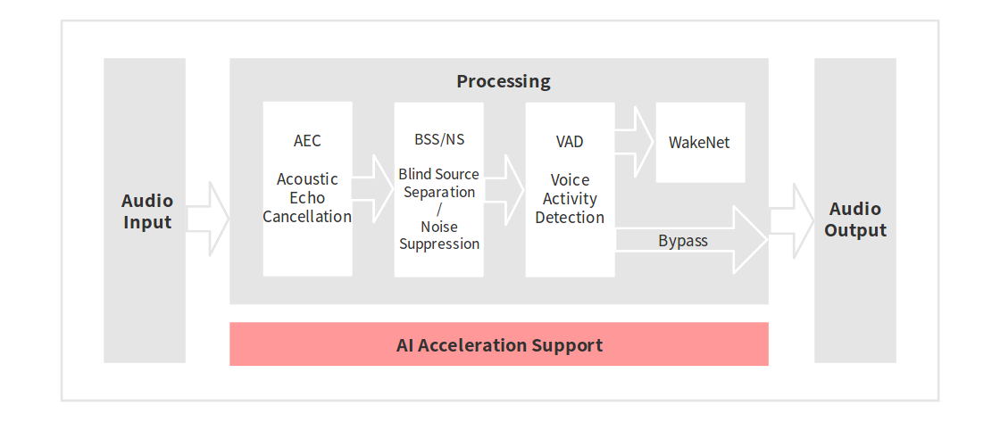
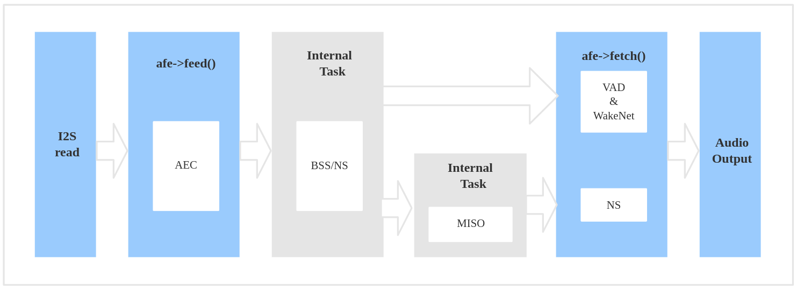

# Audio Front-end 框架[[English]](./README.md)

乐鑫 Audio Front-end(AFE) 算法框架由乐鑫 AI 实验室自主开发。该框架基于 ESP32 系列芯片，能够向主机端提供高质量并且稳定的音频数据。

---

## 概述

乐鑫 AFE 框架以最便捷的方式基于乐鑫的 ESP32 系列芯片进行语音前端处理。使用乐鑫 AFE 框架，您可以获取高质量且稳定的音频数据，从而更加方便地构建唤醒或语音识别等应用。

乐鑫 AFE 的功能支持如下所示：



乐鑫 AFE 的工作流程如下：



乐鑫 AFE 工作流程可以分为 4 块：

- AFE 的创建和初始化
- AFE feed，输入音频数据，feed 内部会先进行 AEC 算法处理
- 内部：AFE BSS/NS 算法处理
- AFE fetch，返回处理过的音频数据和返回值， fetch 内部会进行 VAD 处理，如果用户设置 WakeNet 为 enable 状态，也会进行唤醒词的检测

其中 `afe->feed()` 和 `afe->fetch()` 对用户可见，`Internal BSS/NS Task` 对用户不可见。

> AEC 在 afe->feed() 函数中运行；  
> BSS/NS 为 AFE 内部独立 Task 进行处理；  
> VAD 和 WakeNet 的结果通过 afe->fetch() 函数中获取。

### 选择 AFE handle

目前 AFE 支持单麦和双麦两种应用场景，单麦场景内部 Task 为 NS 处理，双麦场景内部 Task 为 BSS 处理。

- 单麦

		esp_afe_sr_iface_t *afe_handle = &esp_afe_sr_1mic;

- 双麦

		esp_afe_sr_iface_t *afe_handle = &esp_afe_sr_2mic;

### 输入音频

- AFE 单麦场景

	- 输入音频格式为 16KHz, 16bit, 双通道（1个通道为 mic 数据，另一个通道为参考回路）
	- 数据帧长为 32ms, 用户可以使用 `afe->get_feed_chunksize` 来获取需要的采样点数目（采样点数据类型为 int16）
 
 数据排布如下：
 
   

- AFE 双麦场景

	- 输入音频格式为 16KHz, 16bit, 三通道
	- 数据帧长为 32ms, 用户可以使用 `afe->get_feed_chunksize` 来获取需要填充的数据量

 数据排布如下：
 
    

注意：换算成数据量大小为：`afe->get_feed_chunksize * 通道数 * sizeof(short)` 

### AEC 简介

AEC (Acoustic Echo Cancellation) 算法最多支持双麦处理，能够有效的去除 mic 输入信号中的自身播放声音。从而可以在自身播放音乐的情况下进行很好的语音识别等应用。

### NS 简介

NS (Noise Suppression) 算法支持单通道处理，能够对单通道音频中的非人声噪声进行抑制，尤其针对稳态噪声，具有很好的抑制效果。

### BSS 简介

BSS (Blind Source Separation) 算法支持双通道处理，能够很好的将目标声源和其余干扰音进行盲源分离，从而提取出有用音频信号，保证了后级语音的质量。

### VAD 简介

VAD (Voice Activity Detection) 算法支持实时输出当前帧的语音活动状态。

### WakeNet or Bypass 简介

用户可以选择是否在 AFE 中进行唤醒词的识别。当用户调用 `afe->disable_wakenet(afe_data)` 后，则进入 Bypass 模式，AFE 模块不会进行唤醒词的识别。

### 输出音频

AFE 的输出音频为单通道数据，在 WakeNet 开启的情况下，AFE 会输出有目标人声的单通道数据。

---

## 快速开始

### 1. 定义 afe_handle

`afe_handle` 是用户后续调用 afe 接口的函数句柄。用户需要根据单麦和双麦场景选择对应的 `afe_handle`。

单麦场景：

	esp_afe_sr_iface_t *afe_handle = &esp_afe_sr_1mic;

双麦场景：

	esp_afe_sr_iface_t *afe_handle = &esp_afe_sr_2mic;

### 2. 配置 afe

获取 afe 的配置：

	afe_config_t afe_config = AFE_CONFIG_DEFAULT();

可在宏`AFE_CONFIG_DEFAULT()`中调整各算法模块的使能及其相应参数: 

```
#define AFE_CONFIG_DEFAULT() { \
    .aec_init = true, \
    .se_init = true, \
    .vad_init = true, \
    .wakenet_init = true, \
    .vad_mode = 3, \
    .wakenet_model = &WAKENET_MODEL, \
    .wakenet_coeff = &WAKENET_COEFF, \
    .wakenet_mode = DET_MODE_2CH_90, \
    .afe_mode = SR_MODE_HIGH_PERF, \
    .afe_perferred_core = 0, \
    .afe_perferred_priority = 5, \
    .afe_ringbuf_size = 50, \
    .alloc_from_psram = 1, \
    .agc_mode = 2, \
}
```

- aec_init: AEC 算法是否使能。

- se_init: BSS/NS 算法是否使能。

- vad_init: VAD 是否使能。

- wakenet_init: 唤醒是否使能。

- vad_mode: VAD 检测的操作模式，越大越激进。

- wakenet_model/wakenet_coeff/wakenet_mode: 使用 `make menuconfig` 来选择相应的唤醒模型，详见：[WakeNet](https://github.com/espressif/esp-sr/tree/b9504e35485b60524977a8df9ff448ca89cd9d62/wake_word_engine)

- afe_mode: 乐鑫 AFE 目前支持 2 种工作模式，分别为：SR_MODE_LOW_COST, SR_MODE_HIGH_PERF。详细可见 afe_sr_mode_t 枚举。

	- SR_MODE_LOW_COST: 量化版本，占用资源较少。

	- SR_MODE_HIGH_PERF: 非量化版本，占用资源较多。
	
        **ESP32 芯片，只支持模式 SR_MODE_HIGH_PERF;   
        ESP32S3 芯片，两种模式均支持 **

- afe_perferred_core: AFE 内部 BSS/NS 算法，运行在哪个 CPU 核。

- afe_ringbuf_size: 内部 ringbuf 大小的配置。

- alloc_from_psram: 是否优先从外部 psram 分配内存。可配置三个值：

	- 0: 从内部ram分配。
	
	- 1: 部分从外部psram分配。
	
	- 2: 绝大部分从外部psram分配
	
- agc_mode: 将音频线性放大的 level 配置（[0,3]）,0 表示无放大

### 3. 创建 afe_data

用户使用 `afe_handle->create_from_config(&afe_config)` 函数来获得数据句柄，这将会在afe内部使用，传入的参数即为上面第2步中获得的配置。

```
/**
 * @brief Function to initialze a AFE_SR instance
 * 
 * @param afe_config        The config of AFE_SR
 * @returns Handle to the AFE_SR data
 */
typedef esp_afe_sr_data_t* (*esp_afe_sr_iface_op_create_from_config_t)(afe_config_t *afe_config);

```

### 4. feed 音频数据

在初始化 AFE 和 WakeNet 完成后，用户需要将音频数据使用 `afe_handle->feed()` 函数输入到 AFE 中进行处理。

输入的音频大小和排布格式可以参考 **输入音频** 这一步骤。

```
/**
 * @brief Feed samples of an audio stream to the AFE_SR
 *
 *
 * @param afe   The AFE_SR data handle
 * 
 * @param in    The input microphone signal, only support signed 16-bit @ 16 KHZ. The frame size can be queried by the 
 *              `get_samp_chunksize`. The channel number can be queried `get_channel_num`.
 * @return      The size of input
 */
typedef int (*esp_afe_sr_iface_op_feed_t)(esp_afe_sr_data_t *afe, const int16_t* in);

```

获取音频通道数：

使用 `afe_handle->get_channel_num()` 函数可以获取需要传入 `afe_handle->feed()` 函数的 mic 数据通道数。（不含参考回路通道）

```
/**
 * @brief Get the channel number of samples that need to be passed to the fetch function
 * 
 * @param afe The AFE_SR object to query
 * @return The amount of channel number
 */
typedef int (*esp_afe_sr_iface_op_get_channel_num_t)(esp_afe_sr_data_t *afe);
```

### 5. fetch 音频数据

用户调用 `afe_handle->fetch()` 函数可以获取处理完成的单通道音频。  

fetch 的数据采样点数目（采样点数据类型为 int16）可以通过 `afe_handle->get_fetch_chunksize` 获取。

```
/**
 * @brief Get the amount of each channel samples per frame that need to be passed to the function
 *
 * Every speech enhancement AFE_SR processes a certain number of samples at the same time. This function
 * can be used to query that amount. Note that the returned amount is in 16-bit samples, not in bytes.
 *
 * @param afe The AFE_SR object to query
 * @return The amount of samples to feed the fetch function
 */
typedef int (*esp_afe_sr_iface_op_get_samp_chunksize_t)(esp_afe_sr_data_t *afe);
```

用户需要注意 `afe_handle->fetch()` 的返回值：

- AFE_FETCH_CHANNEL_VERIFIED: 音频通道确认 (单麦唤醒，不返回该值)
- AFE_FETCH_NOISE: 侦测到噪声
- AFE_FETCH_SPEECH: 侦测到语音
- AFE_FETCH_WWE_DETECTED: 侦测到唤醒词
- ...

```
/**
 * @brief fetch enhanced samples of an audio stream from the AFE_SR
 *
 * @Warning  The output is single channel data, no matter how many channels the input is.
 *
 * @param afe   The AFE_SR object to query
 * @param out   The output enhanced signal. The frame size can be queried by the `get_samp_chunksize`.
 * @return      The state of output, please refer to the definition of `afe_fetch_mode_t`
 */
typedef afe_fetch_mode_t (*esp_afe_sr_iface_op_fetch_t)(esp_afe_sr_data_t *afe, int16_t* out);
```

### 6. WakeNet 使用

当用户在唤醒后需要进行其他操作，比如离线或在线语音识别，这时候可以暂停 WakeNet 的运行，从而减轻 CPU 的资源消耗。  

用户可以调用 `afe_handle->disable_wakenet(afe_data)` 来停止 WakeNet。 当后续应用结束后又可以调用 `afe_handle->enable_wakenet(afe_data)` 来开启 WakeNet。

### 7. AEC 使用

AEC 的使用和 WakeNet 相似，用户可以根据自己的需求来停止或开启 AEC。

- 停止 AEC

	afe->disable_aec(afe_data);
    
- 开启 AEC

	afe->enable_aec(afe_data);
