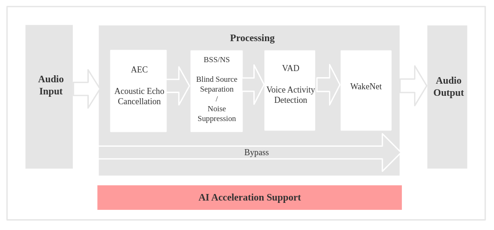
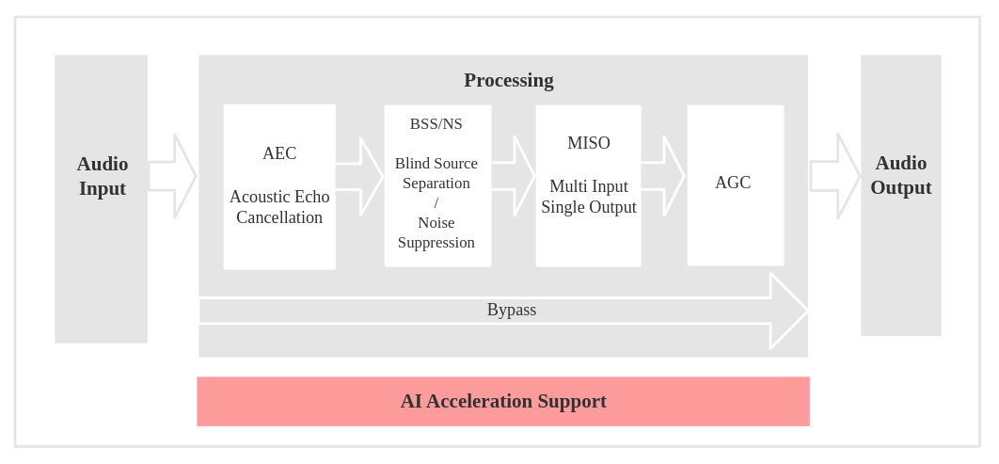

Audio Front-end Framework
=========================

:link_to_translation:`zh_CN:[中文]`

Overview
--------

This guide provides an overview of how to use the Audio Front End (AFE) framework and explains the definition of the input format. 
The AFE framework is designed to process audio data for applications such as speech recognition and voice communication. 
It includes various algorithms like Acoustic Echo Cancellation (AEC), Noise Suppression (NS), Voice Activity Detection (VAD), and Wake Word Detection (WakeNet).

.. list-table::
    :widths: 25 75
    :header-rows: 1

    * - Name
      - Description
    * - AEC (Acoustic Echo Cancellation)
      - Supports maximum two-mic processing, which can effectively remove the echo in the mic input signal, and help with further speech recognition.
    * - NS (Noise Suppression)
      - Supports single-channel processing and can suppress the non-human noise in single-channel audio, especially for stationary noise.
    * - BSS (Blind Source Separation)
      - Supports dual-channel processing, which can well separate the target sound source from the rest of the interference sound, so as to extract the useful audio signal and ensure the quality of the subsequent speech.
    * - MISO (Multi Input Single Output)
      - Supports dual channel input and single channel output. It is used to select a channel of audio output with high signal-to-noise ratio when there is no WakeNet enable in the dual mic scene.
    * - VAD (Voice Activity Detection)
      - Supports real-time output of the voice activity state of the current frame.
    * - AGC (Automatic Gain Control)
      - Dynamically adjusts the amplitude of the output audio, and amplifies the output amplitude when a weak signal is input; When the input signal reaches a certain strength, the output amplitude will be compressed.
    * - WakeNet
      - A wake word engine built upon neural network, and is specially designed for low-power embedded MCUs.

Usage Scenarios
---------------

This section introduces two typical usage scenarios of Espressif AFE framework.

Speech Recognition
^^^^^^^^^^^^^^^^^^

Voice Communication
^^^^^^^^^^^^^^^^^^^

Input Format Definition
----------------------------

The ``input_format`` parameter specifies the arrangement of audio channels in the input data. Each character in the string represents a channel type:

+-----------+---------------------+
| Character | Description         |
+===========+=====================+
| ``M``     | Microphone channel  |
+-----------+---------------------+
| ``R``     | Playback reference  |
|           | channel             |
+-----------+---------------------+
| ``N``     | Unused or unknown   |
|           | channel             |
+-----------+---------------------+

**Example:**
``"MMNR"`` Indicates four channels inorder : microphone channel, microphone channel, unused channel, and playback reference channel.

.. note::

   The input data must be arranged in **channel-interleaved format**.

Using the AFE Framework
----------------------------

Based on the ``menuconfig`` -> ``ESP Speech Recognition``, select the required AFE (Analog Front End) models, such as the WakeNet model, VAD (Voice Activity Detection) model, NS (Noise Suppression) model, etc., and then call the AFE framework in the code using the following steps.

For reference, you can check the code in :project_file:`test_apps/esp-sr/main/test_afe.cpp` or `esp-skainet/examples <https://github.com/espressif/esp-skainet/tree/master/examples>`__.

Step 1: Initialize AFE Configuration
^^^^^^^^^^^^^^^^^^^^^^^^^^^^^^^^^^^^^^

Get the default configuration using ``afe_config_init()`` and customize parameters as needed:

.. code-block:: c

    srmodel_list_t *models = esp_srmodel_init("model");
    afe_config_t *afe_config = afe_config_init("MMNR", models, AFE_TYPE_SR, AFE_MODE_HIGH_PERF);

- ``input_format``: Define the channel arrangement (e.g., ``MMNR``).
- ``models``: List of models (e.g., for NS, VAD, or WakeNet).
- ``afe_type``: Type of AFE (e.g., ``AFE_TYPE_SR`` for speech recognition).
- ``afe_mode``: Performance mode (e.g., ``AFE_MODE_HIGH_PERF``).

Step 2: Create AFE Instance
^^^^^^^^^^^^^^^^^^^^^^^^^^^^^^^^^

Create an AFE instance using the configuration:

.. code-block:: c

    // get handle
    esp_afe_sr_iface_t *afe_handle = esp_afe_handle_from_config(afe_config);
    // create instance
    esp_afe_sr_data_t *afe_data = afe_handle->create_from_config(afe_config);

Step 3: Feed Audio Data
^^^^^^^^^^^^^^^^^^^^^^^^^^

Input audio data to the AFE for processing. The input data must match the ``input_format``:

.. code-block:: c

        int feed_chunksize = afe_handle->get_feed_chunksize(afe_data);
        int feed_nch = afe_handle->get_feed_channel_num(afe_data);
        int16_t *feed_buff = (int16_t *) malloc(feed_chunksize * feed_nch * sizeof(int16_t));
        afe_handle->feed(afe_data, feed_buff);

- ``feed_chunksize``: Number of samples to feed per frame.
- ``feed_nch``: Number of channel of input data.
- ``feed_buff``: Channel-interleaved audio data (16-bit signed, 16 kHz).

Step 4: Fetch Processed Audio
^^^^^^^^^^^^^^^^^^^^^^^^^^^^^^^^

Retrieve the processed single-channel audio data and detection states:

.. code-block:: c

    afe_fetch_result_t *result = afe_handle->fetch(afe_data);
    int16_t *processed_audio = result->data;
    vad_state_t vad_state = result->vad_state;
    wakenet_state_t wakeup_state = result->wakeup_state;

    // if vad cache is exists, please attach the cache to the front of processed_audio to avoid data loss
    if (result->vad_cache_size > 0) {
        int16_t *vad_cache = result->vad_cache;
    }

.. code-block:: c

    // get the processed audio with specified delay, default delay is 2000 ms
    afe_fetch_result_t *result = afe_handle->fetch_with_delay(afe_data, 100 / portTICK_PERIOD_MS);

Resource Occupancy
------------------

For the resource occupancy for AFE, see :doc:`Resource Occupancy <../benchmark/README>`.