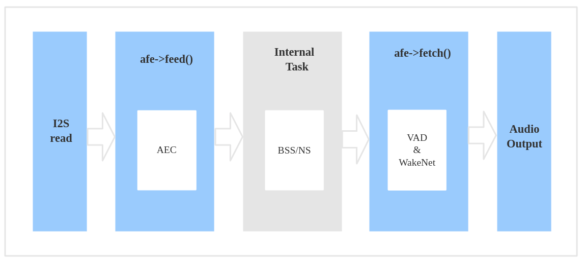

Audio Front-end Framework
=========================

:link_to_translation:`zh_CN:[中文]`

Overview
--------

Any voice-enabled product needs to perform well in a noisy environment, and audio front-end (AFE) algorithms play an important role in building a sensitive voice-user interface (VUI). Espressif’s AI Lab has created a set of audio front-end algorithms that can offer this functionality. Customers can use these algorithms with Espressif’s powerful {IDF_TARGET_NAME} series of chips, in order to build high-performance, yet low-cost, products with a voice-user interface.

.. list-table::
    :widths: 25 75
    :header-rows: 1

    * - Name
      - Description
    * - AEC (Acoustic Echo Cancellation)
      - Supports maximum two-mic processing, which can effectively remove the echo in the mic input signal, and help with further speech recognition.
    * - NS (Noise Suppression)
      - Supports single-channel processing and can suppress the non-human noise in single-channel audio, especially for stationary noise.
    * - BSS (Blind Source Separation)
      - Supports dual-channel processing, which can well separate the target sound source from the rest of the interference sound, so as to extract the useful audio signal and ensure the quality of the subsequent speech.
    * - MISO (Multi Input Single Output)
      - Supports dual channel input and single channel output. It is used to select a channel of audio output with high signal-to-noise ratio when there is no WakeNet enable in the dual mic scene.
    * - VAD (Voice Activity Detection)
      - Supports real-time output of the voice activity state of the current frame.
    * - AGC (Automatic Gain Control)
      - Dynamically adjusts the amplitude of the output audio, and amplifies the output amplitude when a weak signal is input; When the input signal reaches a certain strength, the output amplitude will be compressed.
    * - WakeNet
      - A wake word engine built upon neural network, and is specially designed for low-power embedded MCUs.

Usage Scenarios
---------------

This section introduces two typical usage scenarios of Espressif AFE framework.

Speech Recognition
^^^^^^^^^^^^^^^^^^

Workflow
""""""""

.. figure:: ../../_static/AFE_SR_overview.png
    :alt: overview

Data Flow
"""""""""

#. Use :cpp:func:`ESP_AFE_SR_HANDLE` to create and initialize AFE. Note, :cpp:member:`voice_communication_init` must be configured as false.
#. Use :cpp:func:`feed` to input audio data, which will perform the AEC algorithm inside :cpp:func:`feed` first.
#. Perform the BSS/NS algorithms inside :cpp:func:`feed` first.
#. Use :cpp:func:`fetch` to obtain processed single channel audio data and related information. Note, VAD processing and wake word detection will be performed inside :cpp:func:`fetch`. The specific behavior depends on the configuration of ``afe_config_t`` structure.

Voice Communication
^^^^^^^^^^^^^^^^^^^

Workflow
""""""""

.. figure:: ../../_static/AFE_VOIP_overview.png
    :alt: overview

Data Flow
"""""""""
.. figure:: ../../_static/AFE_VOIP_workflow.png
    :alt: overview

#. Use :cpp:func:`ESP_AFE_VC_HANDLE` to create and initialize AFE. Note, :cpp:member:`voice_communication_init` must be configured as true.
#. Use :cpp:func:`feed` to input audio data, which will perform the AEC algorithm inside :cpp:func:`feed` first.
#. Perform the BSS/NS algorithms inside :cpp:func:`feed` first. Additional MISO algorithm will be performed for dual mic setup.
#. Use :cpp:func:`fetch` to obtain processed single channel audio data and related information. The AGC algorithm processing will be carried out. And the specific gain depends on the config of :cpp:type:`afe_config_t` structure. If it's dual mic, the NS algorithm processing will be carried out before AGC.

.. note::
    #. The :cpp:member:`wakenet_init` and :cpp:member:`voice_communication_init` in :cpp:type:`afe_config_t` cannot be configured to true at the same time.
    #. :cpp:func:`feed` and :cpp:func:`fetch` are visible to users, while other AFE interal tasks such as BSS/NS/MISO are not visible to users.
    #. AEC algorithm is performed in :cpp:func:`feed`.
    #. When :cpp:member:`aec_init` is configured to false, BSS/NS algorithms are performed in :cpp:func:`feed`.

Select AFE Handle
-----------------

Espressif AFE supports both single mic and dual mic setups, and allows flexible combinations of algorithms.

* Single mic
   * Internal task is performed inside the NS algorithm
* Dual mic
   * Internal task is performed inside the BSS algorithm
   * An additional internal task is performed inside the MISO algorithm for voice communication scenario (i.e., :cpp:member:`wakenet_init` = false and :cpp:member:`voice_communication_init` = true)

To obtain the AFE Handle, use the commands below:

* Speech recognition

    ::

        esp_afe_sr_iface_t *afe_handle = &ESP_AFE_SR_HANDLE;

* Voice communication

    ::

        esp_afe_sr_iface_t *afe_handle = &ESP_AFE_VC_HANDLE;

.. _input-audio-1:

Input Audio Data
----------------

Currently, Espressif AFE framework supports both single mic and dual mic setups. Users can configure the number of channels based on the input audio (:cpp:func:`esp_afe_sr_iface_op_feed_t`).

To be specific, users can configure the :cpp:member:`pcm_config` in :cpp:func:`AFE_CONFIG_DEFAULT()`:

* :cpp:member:`total_ch_num` : total number of channels
* :cpp:member:`mic_num` : number of mic channels
* :cpp:member:`ref_num` : number of REF channels

When configuring, note the following requirements:

1. :cpp:member:`total_ch_num` = :cpp:member:`mic_num` + :cpp:member:`ref_num`
2. :cpp:member:`ref_num` = 0 or :cpp:member:`ref_num` = 1 (This is because AEC only supports up to one reference data now)

The supported configurations are:

::

    total_ch_num=1, mic_num=1, ref_num=0
    total_ch_num=2, mic_num=1, ref_num=1
    total_ch_num=2, mic_num=2, ref_num=0
    total_ch_num=3, mic_num=2, ref_num=1

AFE Single Mic
^^^^^^^^^^^^^^
-  Input audio data format: 16 KHz, 16 bit, two channels (one is mic data, another is REF data). Note that if AEC is not required, then there is no need for reference data. Therefore, users can only configure one channel of mic data, and the ref_num can be set to 0.
-  The input data frame length varies to the algorithm modules configured by the user. Users can use :cpp:func:`get_feed_chunksize` to get the number of sampling points (the data type of sampling points is int16).

The input data is arranged as follows:

    .. figure:: ../../_static/AFE_mode_0.png
        :alt: input data of single mic
        :height: 0.7in

AFE Dual Mic
^^^^^^^^^^^^
-  Input audio data format: 16 KHz, 16 bit, three channels (two are mic data, another is REF data). Note that if AEC is not required, then there is no need for reference data. Therefore, users can only configure two channels of mic data, and the ref_num can be set to 0.
-  The input data frame length varies to the algorithm modules configured by the user. Users can use :cpp:func:`get_feed_chunksize` to obtain the data size required (i.e., :cpp:func:`get_feed_chunksize` * :cpp:member:`total_ch_num` * sizeof(short)).

The input data is arranged as follows:

    .. figure:: ../../_static/AFE_mode_other.png
        :alt: input data of dual mic
        :height: 0.75in

Output Audio
------------

The output audio of AFE is single-channel data.
- In the speech recognition scenario, AFE outputs single-channel data with human voice when WakeNet is enabled.
- In the voice communication scenario, AFE outputs single channel data with higher signal-to-noise ratio.

Enable Wake Word Engine WakeNet
--------------------------------

When performing AFE audio front-end processing, the user can choose whether to enable wake word engine :doc:`WakeNet <../wake_word_engine/README>` to allow waking up the chip via wake words.

Users can disable WakeNet to reduce the CPU resource consumption and perform other operations after wake-up, such as offline or online speech recognition. To do so, users can configure :cpp:func:`disable_wakenet()` to enter Bypass mode.

Users can also call :cpp:func:`enable_wakenet()` to enable WakeNet later whenever needed.

.. only:: esp32

    ESP32 only supports one wake word. Users cannot switch between different wake words.

.. only:: esp32s3

    ESP32-S3 allows users to switch among different wake words. After the initialization of AFE, ESP32-S3 allows users to change wake words by calling :cpp:func:`set_wakenet()` . For example, use ``set_wakenet(afe_data, "wn9_hilexin")`` to use "Hi Lexin" as the wake word. For details on how to configure more than one wake words, see Section :doc:`flash_model <../flash_model/README>`.

Enable Acoustic Echo Cancellation (AEC)
----------------------------------------

The usage of AEC is similar to that of WakeNet. Users can disable or enable AEC according to requirements.

-  Disable AEC

    ``afe->disable_aec(afe_data);``

-  Enable AEC

    ``afe->enable_aec(afe_data);``

.. only:: html

    Programming Procedures
    ----------------------

    Define afe_handle
    ^^^^^^^^^^^^^^^^^

    ``afe_handle`` is the function handle that the user calls the AFE interface. Therefore, the first step is to obtain ``afe_handle``.

    -  Speech recognition

        ::

            esp_afe_sr_iface_t *afe_handle = &ESP_AFE_SR_HANDLE;

    -  Voice communication

        ::

            esp_afe_sr_iface_t *afe_handle = &ESP_AFE_VC_HANDLE;

    Configure AFE
    ^^^^^^^^^^^^^

    Get the configuration of AFE:

    ::

        afe_config_t afe_config = AFE_CONFIG_DEFAULT();

    Users can further configure the corresponding parameters in ``afe_config``:

    ::

        #define AFE_CONFIG_DEFAULT() { \
            // Configures whether or not to enable AEC
            .aec_init = true, \
            // Configures whether or not to enable BSS/NS
            .se_init = true, \
            // Configures whether or not to enable VAD (only for speech recognition)
            .vad_init = true, \
            // Configures whether or not to enable WakeNet
            .wakenet_init = true, \
            // Configures whether or not to enable voice communication (cannot be enabled when wakenet_init is also enabled)
            .voice_communication_init = false, \
            // Configures whether or not to enable AGC for voice communication
            .voice_communication_agc_init = false, \
            // Configures the AGC gain (unit: dB)
            .voice_communication_agc_gain = 15, \
            // Configures the VAD mode (the larger the number is, the more aggressive VAD is)
            .vad_mode = VAD_MODE_3, \
            // Configures the wake model. See details below.
            .wakenet_model_name = NULL, \
            // Configures the wake mode. (corresponding to wakeup channels. This should be configured based on the number of mic channels)
            .wakenet_mode = DET_MODE_2CH_90, \
            // Configures AFE mode (SR_MODE_LOW_COST or SR_MODE_HIGH_PERF)
            .afe_mode = SR_MODE_LOW_COST, \
            // Configures the internal BSS/NS/MISO algorithm of AFE will be running on which CPU core
            .afe_perferred_core = 0, \
            // Configures the priority of BSS/NS/MISO algorithm tasks
            .afe_perferred_priority = 5, \
            // Configures the internal ringbuf size
            .afe_ringbuf_size = 50, \
            // Configures the memory allocation mode. See details below.
            .memory_alloc_mode = AFE_MEMORY_ALLOC_MORE_PSRAM, \
            // Configures the linear audio amplification level. See details below.
            .agc_mode = AFE_MN_PEAK_AGC_MODE_2, \
            // Configures the total number of audio channels
            .pcm_config.total_ch_num = 3, \
            // Configures the number of microphone channels
            .pcm_config.mic_num = 2, \
            // Configures the number of reference channels
            .pcm_config.ref_num = 1, \
        }

    *  :cpp:member:`wakenet_model_name` : configures the wake model. The default value in :cpp:type:`AFE_CONFIG_DEFAULT()` is NULL. Note:
        * After selecting the wake model via ``idf.py menuconfig``, please configure :cpp:member:`create_from_config` to the configured wake model (type string) before using. For more information about wake model, go to Section :doc:`flash_model <../flash_model/README>` .
        * :cpp:func:`esp_srmodel_filter()` can be used to obtain the model name. However, if more than one models are configured via ``idf.py menuconfig`` , this function returns any of them configured models randomly.

    *  :cpp:member:`afe_mode` :configures the AFE mode.

        .. list::

            :esp32s3: - :cpp:enumerator:`SR_MODE_LOW_COST` : quantized, which uses less resource
            - :cpp:enumerator:`SR_MODE_HIGH_PERF` : unquantized, which uses more resource

        For details, see :cpp:enumerator:`afe_sr_mode_t` .

    *  :cpp:member:`memory_alloc_mode` : configures how the memory is allocated
        -  :cpp:enumerator:`AFE_MEMORY_ALLOC_MORE_INTERNAL` : allocate most memory from internal ram
        -  :cpp:enumerator:`AFE_MEMORY_ALLOC_INTERNAL_PSRAM_BALANCE` : allocate some memory from the internal ram
        -  :cpp:enumerator:`AFE_MEMORY_ALLOC_MORE_PSRAM` : allocate most memory from external psram

    -  :cpp:member:`agc_mode` : configures peak agc mode. Note that, this parameter is only for speech recognition scenarios, and is only valid when WakeNet is enabled:
        -  :cpp:enumerator:`AFE_MN_PEAK_AGC_MODE_1` : feed linearly amplified audio signals to MultiNet, peak is -5 dB.
        -  :cpp:enumerator:`AFE_MN_PEAK_AGC_MODE_2` : feed linearly amplified audio signals to MultiNet, peak is -4 dB.
        -  :cpp:enumerator:`AFE_MN_PEAK_AGC_MODE_3` : feed linearly amplified audio signals to MultiNet, peak is -3 dB.
        -  :cpp:enumerator:`AFE_MN_PEAK_NO_AGC` : feed original audio signals to MultiNet.

    -  :cpp:member:`pcm_config` : configures the audio signals fed through :cpp:func:`feed` :
        - :cpp:member:`total_ch_num` : total number of channels
        - :cpp:member:`mic_num` : number of mic channels
        - :cpp:member:`ref_num` : number of REF channels

        There are some limitation when configuring these parameters. For details, see Section :ref:`input-audio-1` .

    Create afe_data
    ^^^^^^^^^^^^^^^

    The user uses the :cpp:func:`esp_afe_sr_iface_op_create_from_config_t` function to create the data handle based on the parameters configured in previous steps.

    ::

        /**
        * @brief Function to initialze a AFE_SR instance
        *
        * @param afe_config        The config of AFE_SR
        * @returns Handle to the AFE_SR data
        */
        typedef esp_afe_sr_data_t* (*esp_afe_sr_iface_op_create_from_config_t)(afe_config_t *afe_config);

    Feed Audio Data
    ^^^^^^^^^^^^^^^

    After initializing AFE, users need to input audio data into AFE by :cpp:func:`feed` function for processing. The format of input audio data can be found in Section :ref:`input-audio-1` .

    ::

        /**
        * @brief Feed samples of an audio stream to the AFE_SR
        *
        * @Warning  The input data should be arranged in the format of channel interleaving.
        *           The last channel is reference signal if it has reference data.
        *
        * @param afe   The AFE_SR object to query
        *
        * @param in    The input microphone signal, only support signed 16-bit @ 16 KHZ. The frame size can be queried by the
        *              `get_feed_chunksize`.
        * @return      The size of input
        */
        typedef int (*esp_afe_sr_iface_op_feed_t)(esp_afe_sr_data_t *afe, const int16_t* in);

    Get the number of audio channels
    ^^^^^^^^^^^^^^^^^^^^^^^^^^^^^^^^

    :cpp:func:`get_total_channel_num()` function can provide the number of channels that need to be put into :cpp:func:`feed()` function. Its return value is equal to ``pcm_config.mic_num + pcm_config.ref_num`` configured in :cpp:func:`AFE_CONFIG_DEFAULT()`.

    ::

        /**
        * @brief Get the total channel number which be config
        *
        * @param afe   The AFE_SR object to query
        * @return      The amount of total channels
        */
        typedef int (*esp_afe_sr_iface_op_get_total_channel_num_t)(esp_afe_sr_data_t *afe);

    Fetch Audio Data
    ^^^^^^^^^^^^^^^^

    Users can get the processed single-channel audio and related information by :cpp:func:`fetch` function.

    The number of data sampling points of :cpp:func:`fetch` (the data type of sampling point is ``int16``) can be obtained by :cpp:func:`get_feed_chunksize`.

    ::

        /**
        * @brief Get the amount of each channel samples per frame that need to be passed to the function
        *
        * Every speech enhancement AFE_SR processes a certain number of samples at the same time. This function
        * can be used to query that amount. Note that the returned amount is in 16-bit samples, not in bytes.
        *
        * @param afe The AFE_SR object to query
        * @return The amount of samples to feed the fetch function
        */
        typedef int (*esp_afe_sr_iface_op_get_samp_chunksize_t)(esp_afe_sr_data_t *afe);

    The declaration of :cpp:func:`fetch`:

    ::

        /**
        * @brief fetch enhanced samples of an audio stream from the AFE_SR
        *
        * @Warning  The output is single channel data, no matter how many channels the input is.
        *
        * @param afe   The AFE_SR object to query
        * @return      The result of output, please refer to the definition of `afe_fetch_result_t`. (The frame size of output audio can be queried by the `get_fetch_chunksize`.)
        */
        typedef afe_fetch_result_t* (*esp_afe_sr_iface_op_fetch_t)(esp_afe_sr_data_t *afe);

    Its return value is a pointer of structure, and the structure is defined as follows:

    ::

        /**
        * @brief The result of fetch function
        */
        typedef struct afe_fetch_result_t
        {
        int16_t *data;                          // the data of audio.
        int data_size;                          // the size of data. The unit is byte.
        int wakeup_state;                       // the value is wakenet_state_t
        int wake_word_index;                    // if the wake word is detected. It will store the wake word index which start from 1.
        int vad_state;                          // the value is afe_vad_state_t
        int trigger_channel_id;                 // the channel index of output
        int wake_word_length;                   // the length of wake word. It's unit is the number of samples.
        int ret_value;                          // the return state of fetch function
        void* reserved;                         // reserved for future use
        } afe_fetch_result_t;

Resource Occupancy
------------------

For the resource occupancy for this model, see :doc:`Resource Occupancy <../benchmark/README>`.