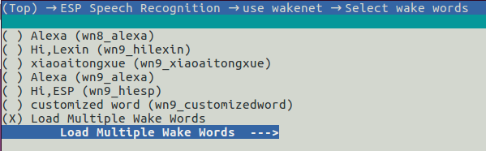
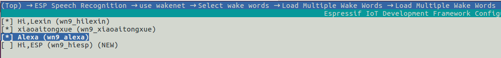

Flashing Models
===============

:link_to_translation:`zh_CN:[中文]`

In the AI industry, a model refers to a mathematical representation of a system or process. It is used to make predictions or decisions based on input data. There are many types of models, such as decision trees, neural networks, and support vector machines, each with their own strengths and weaknesses. Esprssif also provides our trained models such as WakeNet and MultiNet (see the model data used in :project:`model`)

To use our models in your project, you need to flash these models. Currently, ESP-SR supports the following methods to flash models:

.. only:: esp32

    ESP32: Load directly from Flash

.. only:: esp32s3

    ESP32-S3:

    -  Load directly from SIP Flash File System (SPIFFS)
    -  Load from external SD card

    So that on ESP32-S3 you can:

        -  Greatly reduce the size of the user application APP BIN
        -  Supports the selection of up to two wake words
        -  Support online switching of Chinese and English Speech Command Recognition
        -  Convenient for users to perform OTA
        -  Supports reading and changing models from SD card, which is more convenient and can reduce the size of module Flash used in the project
        -  When the user is developing the code, when the modification does not involve the model, it can avoid flashing the model data every time, greatly reducing the flashing time and improving the development efficiency

Configuration
-------------

Run ``idf.py menuconfig`` to navigate to ``ESP Speech Recognition``:

.. figure:: ../../_static/model-1.png
    :alt: overview

    overview

.. only:: esp32s3

    Model Data Path
    ~~~~~~~~~~~~~~~

    This option indicates the storage location of the model data: ``spiffs partition`` or ``SD Card``.

    -  ``spiffs partition`` means that the model data is stored in the SPIFFS partition, and the model data will be loaded from the SPIFFS partition
    -  ``SD Card`` means that the model data is stored in the SD card, and the model data will be loaded from the SD card

Use AFE
~~~~~~~

This option is enabled by default. Users do not need to modify it. Please keep the default configuration.

Use WakeNet
~~~~~~~~~~~

This option is enabled by default. When the user only uses ``AEC`` or ``BSS``, etc., and does not need ``WakeNet`` or ``MultiNet``, please disable this option, which reduces the size of the project firmware.

Select wake words by via ``menuconfig`` by navigating to ``ESP Speech Recognition`` > ``Select wake words``. The model name of wake word in parentheses must be used to initialize WakeNet handle.

    |select wake wake|

If you want to select multiple wake words, please select ``Load Multiple Wake Words``

    |multi wake wake|

Then you can select multiple wake words at the same time:

    |image1|

.. only:: esp32

    .. note::
        ESP32 doesn't support multiple wake words.

.. only:: esp32s3

    .. note::
        ESP32-S3 does support multiple wake words. Users can select more than one wake words according to the hardware flash size.

For more details, please refer to :doc:`WakeNet <../wake_word_engine/README>` .

Use Multinet
~~~~~~~~~~~~

This option is enabled by default. When users only use WakeNet or other algorithm modules, please disable this option, which reduces the size of the project firmware in some cases.

Chinese Speech Commands Model
^^^^^^^^^^^^^^^^^^^^^^^^^^^^^

.. only:: esp32

    ESP32 only supports command words in Chinese:

    -  None
    -  Chinese single recognition (MultiNet2)

.. only:: esp32s3

    ESP32-S3 supports command words in both Chinese and English:

    -  None
    -  Chinese single recognition (MultiNet4.5)
    -  Chinese single recognition (MultiNet4.5 quantized with 8-bit)
    -  English Speech Commands Model

    The user needs to add Chinese Speech Command words to this item when ``Chinese Speech Commands Model`` is not ``None``.

.. only:: esp32s3

    English Speech Commands Model
    ^^^^^^^^^^^^^^^^^^^^^^^^^^^^^

    ESP32-S3 supports command words in both Chinese and English, and allows users to switch between these two languages.

    -  None
    -  English recognition (MultiNet5 quantized with 8-bit, depends on WakeNet8)
    -  Add Chinese speech commands

    The user needs to add English Speech Command words to this item when ``English Speech Commands Model`` is not ``None``.

For more details, please refer to Section :doc:`MultiNet <../speech_command_recognition/README>` .

How To Use
----------

After the above-mentioned configuration, users can initialize and start using the models following the examples described in the `ESP-Skainet <https://github.com/espressif/esp-skainet>`_ repo.

Here, we only introduce the code implementation, which can also be found in `model_path.c <../src/model_path.c>`_ .

.. only:: esp32

    ESP32 can only load model data from flash. Therefore, the model data in the code will automatically read the required data from the Flash according to the address. Note that, ESP32 and ESP32-S3 APIs are compatible.

.. only:: esp32s3

    ESP32-S3 can load model data from SPIFFS or SD card.

Load Model Data from SPIFFS
~~~~~~~~~~~~~~~~~~~~~~~~~~~~~~~~~

#. Write a partition table:

    ::

        model,  data, spiffs,         , SIZE,

    Among them, ``SIZE`` can refer to the recommended size when the user uses ``idf.py build`` to compile, for example: ``Recommended model partition size: 500K``

#. Initialize the SPIFFS partition: User can use ``esp_srmodel_init()`` API to initialize SPIFFS and return all loaded models.

    -  base_path: The model storage ``base_path`` is ``srmodel`` and cannot be changed
    -  partition_label: The partition label of the model is ``model``, which needs to be consistent with the ``Name`` in the above partition table

After completing the above configuration, the project will automatically generate ``model.bin`` after the project is compiled, and flash it to the SPIFFS partition.

.. only:: esp32s3

    Load Model Data from SD Card
    ~~~~~~~~~~~~~~~~~~~~~~~~~~~~~~~~~

    When configured to load model data from ``SD Card``, users need to:

    -  Manually load model data from SD card
        After the above-mentioned configuration, users can compile the code, and copy the files in ``model/target`` to the root directory of the SD card.

    -  Customized path
        Users can also use customized path by configuring the :cpp:func:`get_model_base_path()` of ``model/model_path.c``.

        .. only:: html

            For example, users can configure the customized path to the ``espmodel`` in the SD card:

                ::

                    char *get_model_base_path(void)
                    {
                    #if defined CONFIG_MODEL_IN_SDCARD
                        return "sdcard/espmodel";
                    #elif defined CONFIG_MODEL_IN_SPIFFS
                        return "srmodel";
                    #else
                        return NULL;
                    #endif
                    }

    -  Initialize SD card
        Users must initialize SD card so the chip can load SD card. Users of `ESP-Skainet <https://github.com/espressif/esp-skainet>`_ can call  ``esp_sdcard_init("/sdcard", num);`` to initialize any board supported SD cards. Otherwise, users need to write the initialization code themselves.
        After the above-mentioned steps, users can flash the project.

.. |select wake wake| image:: ../../_static/wn_menu1.png

.. only:: html

    Model initialization and Usage
    ~~~~~~~~~~~~~~~~~~~~~~~~~~~~~~

    ::

       //
       // step1: initialize SPIFFS and return models in SPIFFS
       //
       srmodel_list_t *models = esp_srmodel_init("model");

       //
       // step2: select the specific model by keywords
       //
       char *wn_name = esp_srmodel_filter(models, ESP_WN_PREFIX, NULL); // select WakeNet model
       char *nm_name = esp_srmodel_filter(models, ESP_MN_PREFIX, NULL); // select MultiNet model
       char *alexa_wn_name = esp_srmodel_filter(models, ESP_WN_PREFIX, "alexa"); // select WakeNet with "alexa" wake word.
       char *en_mn_name = esp_srmodel_filter(models, ESP_MN_PREFIX, ESP_MN_ENGLISH); // select english MultiNet model
       char *cn_mn_name = esp_srmodel_filter(models, ESP_MN_PREFIX, ESP_MN_CHINESE); // select english MultiNet model

       // It also works if you use the model name directly in your code.
       char *my_wn_name = "wn9_hilexin"
       // we recommend you to check that it is loaded correctly
        if (!esp_srmodel_exists(models, my_wn_name))
            printf("%s can not be loaded correctly\n")

       //
       // step3: initialize model
       //
       esp_wn_iface_t *wakenet = esp_wn_handle_from_name(wn_name);
       model_iface_data_t *wn_model_data = wakenet->create(wn_name, DET_MODE_2CH_90);

       esp_mn_iface_t *multinet = esp_mn_handle_from_name(mn_name);
       model_iface_data_t *mn_model_data = multinet->create(mn_name, 6000);
