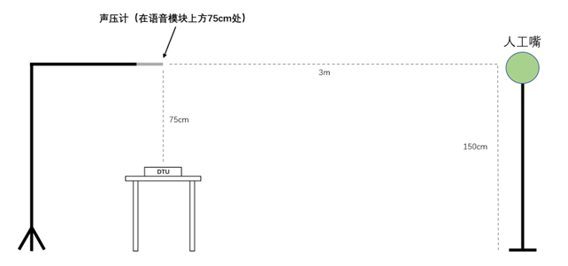

Test Method and Test Report
===========================

:link_to_translation:`zh_CN:[中文]`

To ensure the DUT performance, some tests can be performed to verify the following parameters:

- Wake-up rate
- Speech recognition rate
- False wake-up rate
- Response Accuracy Rate Under Playback
- Response time

Test Room Requirement
---------------------

These tests must be performed in a proper test room. The requirements for this test room include:

* **Size**

    * Area: no smaller than 4 m * 3.2 m
    * Height: no lower than 2.3 m

* **Setup**

    * The floor should be equipped with carpet, the ceiling should be equipped with common acoustic damping materials, and the wall should have 1 to 2 walls with curtains to prevent strong reflection.
    * Room reverberation time (RT60) within the range of [125, 8k] shall be within 0.2 - 0.7 seconds.
    * Do not use anechoic chamber.

* **Background noise**: must < 35 dBA, best < 30 dBA

* **Temperature and humidity**: 20±10°C, 50%±20%

* **Placement of DUT, external noise and voice**:

    * Place the DUT, external noise and voice according the actual use scenario of your DUT.

.. note::
    The RT60, background noise, and the placement of DUT, external noise and voice should be kept the same in all tests.

Test Case Design
----------------

When designing test cases, it's suggested to factor in **some or all of the following parameters** based on the actual use scenarios of the product. For example,

- Different types of noises
    - White noise
    - Human noise
    - Music
    - News
    - . . . . . .
    - Test cases with multiple noise sources can also be added when necessary
- Different noise levels
    - < 35 dBA
    - 45 dBA
    - 55 dBA
    - 65 dBA
- Different voice levels
    - 54 dBA
    - 59 dBA
    - 64 dBA
- Different SNR
    - 9 dBA
    - 4 dBA
    - -1 dBA

Espressif Test and Result
-------------------------

In all the tests described in this section, the placement of DUT, external noise and voice can be seen in the diagrams below.

.. figure:: ../../_static/test_reference_position2.png
    :align: center
    :alt: overview

As seen in the diagrams above, place

- The DUT 0.75 meters above the ground.
- The voice 3 meters away from the DUT and 1.5 meters above the ground.
- The external noise 45°C apart from the voice, 2 meters away from the DUT and 1.2 meters above the ground.
- The sound pressure meter right above the DUT by 0.75 meters.

Wake-up Rate Test
~~~~~~~~~~~~~~~~~

**Wake-up rate**: the probability of the DUT correctly wakes up to a wake word.

**Espressif's Wake-up Rate Test and Result**

.. list-table::
    :widths: 10 25 15 15 20 15
    :header-rows: 1

    * - Test Case
      - Noise Type
      - Noise Decibel
      - Voice Decibel
      - SNR
      - Wake-up Rate
    * - 1
      - /
      - /
      - 59 dBA
      - /
      - 99%
    * - 2
      - White noise
      - 55 dBA
      - 59 dBA
      - >= 4 dBA
      - 99%
    * - 3
      - Human noise
      - 55 dBA
      - 59 dBA
      - >= 4 dBA
      - 99%

Speech Recognition Rate Test
~~~~~~~~~~~~~~~~~~~~~~~~~~~~

**Speech recognition rate**: the probability of the DUT correctly recognizes the established command words when the DUT is in the speech recognition state.

**Espressif's Speech Recognition Rate Test and Result**

.. list-table::
    :widths: 10 25 15 15 20 15
    :header-rows: 1

    * - Test Case
      - Noise Type
      - Noise Decibel
      - Voice Decibel
      - SNR
      - Speech Recognition Rate
    * - 1
      - /
      - /
      - 59 dBA
      - /
      - 91.5%
    * - 2
      - White noise
      - 55 dBA
      - 59 dBA
      - >= 4 dBA
      - 78.25%
    * - 3
      - Human noise
      - 55 dBA
      - 59 dBA
      - >= 4 dBA
      - 82.77%

False Wake-up Rate Test
~~~~~~~~~~~~~~~~~~~~~~~

**False wake-up rate**: the probability of the DUT incorrectly wakes up to a random word (that is not a wake word).

**Espressif's False Wake-up Rate Test and Result**

.. list-table::
    :widths: 20 20 20 20 20
    :header-rows: 1

    * - Test Case
      - Noise Type
      - Noise Decibel
      - Test Duration
      - Number of False Wake-up
    * - 1
      - Music
      - 55 dBA
      - 12 hours
      - 1 time
    * - 2
      - News
      - 55 dBA
      - 12 hours
      - 1 time

Response Accuracy Rate Under Playback
~~~~~~~~~~~~~~~~~~~~~~~~~~~~~~~~~~~~~

**Interrupting wake-up rate**: the probability of the DUT correctly responds to a wake word or a command word while playing sounds, such as music or TTS. This test is required for products with AEC feature.

**Espressif's Interrupting Wake-up Rate Test and Result**

.. list-table::
    :widths: 15 15 15 20 15 15
    :header-rows: 1

    * - Test Case
      - Noise Type
      - Noise / Voice Decibel
      - SNR
      - Wake-up Rate
      - Speech Recognition Rate
    * - 1
      - Music
      - 69 dBA / 59 dBA
      - >= 10 dBA
      - 100%
      - 96%
    * - 2
      - TTS
      - 69 dBA / 59 dBA
      - >= 10 dBA
      - 100%
      - 96%

Response Time Test
~~~~~~~~~~~~~~~~~~

**Response time**: the time required for the DUT to respond to a command word. It's measured as the time duration after a command word and before the DUT starts playing sound (see the diagram below).

**Espressif's Response Time Test and Result**

.. list-table::
    :widths: 25 25 25 25
    :header-rows: 1

    * - Test Case
      - Noise / Voice Decibel
      - SNR
      - Response Time
    * - 1
      - NA / 59 dBA
      - /
      - < 500 ms