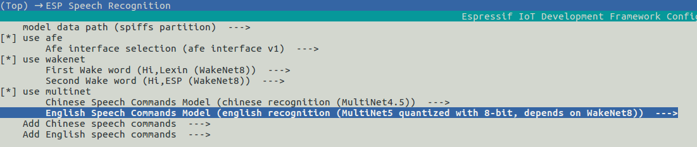

# Model loading method[[中文]](./README_CN.md)

In esp-sr, both WakeNet and MultiNet will use a large amount of model data, and the model data is located in `ESP-SR_PATH/model/`.
Currently esp-sr supports the following model loading methods:

ESP32:

- Load directly from Flash

ESP32S3:  

- Load from Flash spiffs partition
- Load from external SDCard

So that on ESP32S3 you can:

- Greatly reduce the size of the user application APP BIN
- Supports the selection of up to two wake words
- Support online switching of Chinese and English Speech Command Recognition
- Convenient for users to perform OTA
- Supports reading and changing models from SD card, which is more convenient and can reduce the size of module Flash used in the project
- When the user is developing the code, when the modification does not involve the model, it can avoid flashing the model data every time, greatly reducing the flashing time and improving the development efficiency

## 1. Model configuration introduction

Run `idf.py menuconfig` navigate to `ESP Speech Recognition`:



### 1.1 model data path

This option is only available on ESP32S3. It indicates the storage location of the model data. It supports the choice of `spiffs partition` or `SD Card`.

- `spiffs partition` means that the model data is stored in the Flash spiffs partition, and the model data will be loaded from the Flash spiffs partition
- `SD Card` means that the model data is stored in the SD card, and the model data will be loaded from the SD Card

### 1.2 use afe

This option needs to be turned on. Users do not need to modify it. Please keep the default configuration.

### 1.3 use wakenet

This option is turned on by default. When the user only uses `AEC` or `BSS`, etc., and does not need to run `WakeNet` or `MultiNet`, please turn off this option, which will reduce the size of the project firmware.

- Select wake words by menuconfig, `ESP Speech Recognition -> Select wake words`. The model name of wake word in parentheses is used to initialize wakenet handle.   
    
- If you want to select multiple wake words, please select `Load Multiple Wake Words` ( **Note this option only supports ESP32S3**)
  
  Then you can select multiple wake words at the same time  


For more details, please refer to [WakeNet](../wake_word_engine/README.md) .
 
### 1.4 use multinet

This option is turned on by default. When users only use WakeNet or other algorithm modules, please turn off this option, which will reduce the size of the project firmware in some cases.

ESP32 chip only supports Chinese Speech Commands Recognition. 

ESP32S3 supports Chinese and English Speech Commands Recognition, and supports Chinese and English recognition model switching.

- Chinese Speech Commands Model

 Chinese Speech Commands Recognition model selection.

 ESP32 supports:

  - None
  - chinese single recognition (MultiNet2)
 
 ESP32S3 支持：

  - None
  - chinese single recognition (MultiNet4.5)
  - chinese single recognition (MultiNet4.5 quantized with 8-bit)


- English Speech Commands Model

 English Speech Commands Recognition model selection.
 
 This option does not support ESP32.

 ESP32S3 Supports：

  - None
  - english recognition (MultiNet5 quantized with 8-bit, depends on WakeNet8)


- Add Chinese speech commands

 The user needs to add Chinese Speech Command words to this item when `Chinese Speech Commands Model` is not `None`.

- Add English speech commands

 The user needs to add English Speech Command words to this item when `Chinese Speech Commands Model` is not `None`.

For more details, please refer to [MultiNet](../speech_command_recognition/README.md) .

## 2. How to use

Here is an introduction to the code implementation of model data loading in the project. If you want get more detailes, please refer to esp-skainet examples.

### 2.1.1 ESP32  

When the user uses ESP32, since it only supports loading the model data directly from the Flash, the model data in the code will automatically read the required data from the Flash according to the address.  
Now The ESP32S3 API is compatible with ESP32. You can refer to the ESP32S3 method to load and initialize the model.

### 2.1.2  ESP32S3  

- Step1: Write a partition table:

   ```
   model,  data, spiffs,         , SIZE,
   ```
   Among them, `SIZE` can refer to the recommended size when the user uses 'idf.py build' to compile, for example:
   
   ```
   Recommended model partition size: 500K
   ```
    After completing the above configuration, the project will automatically generate `model.bin` after the project is compiled, and flash it to the spiffs partition. 

- Step2: Initialize the spiffs partition
  User can use `esp_srmodel_init()` API to initialize spiffs and return all loaded models.  
    - base_path: The model storage `base_path` is `srmodel` and cannot be changed
    - partition_label: The partition label of the model is `model`, which needs to be consistent with the `Name` in the above partition table
   
    **<font color=red>Note: After the user changes the model, be sure to run `idf.py clean` before compiling again.</font>**

## 2.2 ESP32S3  
``` 
    //
    // step1: initialize spiffs and return models in spiffs
    // 
    srmodel_list_t *models = esp_srmodel_init("model");

    //
    // step2: select the specific model by keywords
    //
    char *wn_name = esp_srmodel_filter(models, ESP_WN_PREFIX, NULL); // select wakenet model
    char *nm_name = esp_srmodel_filter(models, ESP_MN_PREFIX, NULL); // select multinet model
    char *alexa_wn_name  = esp_srmodel_filter(models, ESP_WN_PREFIX, "alexa"); // select wakenet with "alexa" wake word.
    char *en_mn_name  = esp_srmodel_filter(models, ESP_MN_PREFIX, ESP_MN_ENGLISH); // select english multinet model
    char *cn_mn_name  = esp_srmodel_filter(models, ESP_MN_PREFIX, ESP_MN_CHINESE); // select english multinet model
    
    // It also works if you use the model name directly in your code.
    char *my_wn_name = "wn9_hilexin"  
    // we recommend you to check that it is loaded correctly
    if (!esp_srmodel_exists(models, my_wn_name))
        printf("%s can not be loaded correctly\n")

    //
    // step3: initialize model
    //
    esp_wn_iface_t *wakenet = esp_wn_handle_from_name(wn_name);
    model_iface_data_t *wn_model_data = wakenet->create(wn_name, DET_MODE_2CH_90);

    esp_mn_iface_t *multinet = esp_mn_handle_from_name(mn_name);
    model_iface_data_t *mn_model_data = multinet->create(mn_name, 6000);

```

