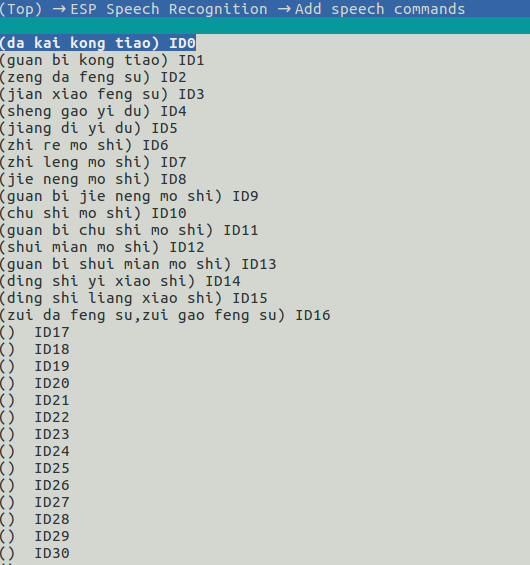
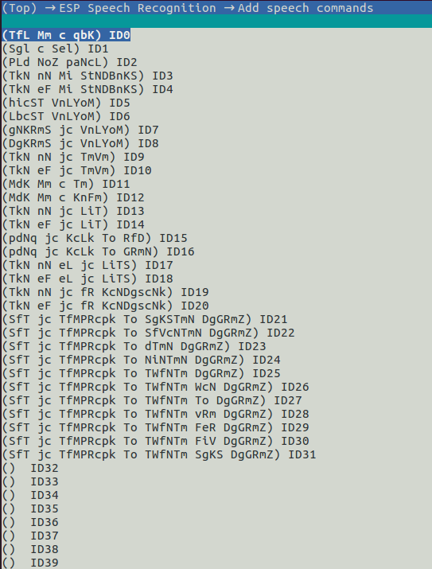

# MultiNet Introduction

MultiNet is a lightweight model specially designed based on [CRNN](https://arxiv.org/pdf/1703.05390.pdf) and [CTC](http://citeseerx.ist.psu.edu/viewdoc/download?doi=10.1.1.75.6306&rep=rep1&type=pdf) for the implementation of multi-command recognization. Now, up to 200 speech commands, including customized commands, are supported. 

## Overview

MultiNet uses the **MFCC features** of an audio clip as input, and the **phonemes** (Chinese or English) as output. By comparing the output phonemes, the relevant Chinese or English command is identified.

The following table shows the model support of Espressif SoCs:


## Commands Recognition Process

1. Add customized commands to the speech command queue.
2. Prepare an audio clip of 30 ms (16 KHz, 16 bit, mono).
3. Input this audio to the MFCC model and get its **MFCC features**.
4. Input the obtained **MFCC features** to MultiNet and get the output **phoneme**.
5. Input the obtained **phoneme** to the Language model and get the output.
6. Compare the output against the existing speech commands one by one, and output the Command ID of the matching command (if any).

Please see the flow diagram below:


## User Guide

### Basic Configuration

Define the following two variables before using the command recognition model:

1. Model version  
	The model version has been configured in `menuconfig` to facilitate your development. Please configure in `menuconfig` and add the following line in your code:  
	
	`static const esp_mn_iface_t *multinet = &MULTINET_MODEL;`
	
2. Model parameter  
	The language supported and the effectiveness of the model is determined by model parameters. Now only commands in Chinese are supported. Please configure the `MULTINET_COEFF` option in `menuconfig` and add the following line in your code to generate the model handle. The 6000 is the audio length for speech recognition, in ms, the range of sample_length is 0~6000.
	   
	`model_iface_data_t *model_data = multinet->create(&MULTINET_COEFF, 6000);`
		

### Modify Speech Commands

For Chinese MultiNet, we use Pinyin without tone as units.　
For English MultiNet, we use international phonetic alphabet as unit. [multinet_g2p.py](../../tool/multinet_g2p.py) is used to convert English phrase into phonemes which can be recognized by multinet．　
Now, the MultiNet support two methods to modify speech commands.　

#### 1.menuconfig (before compilation)

Users can define their own speech commands by `idf.py menuconfig -> ESP Speech Recognition -> add speech commands` 

**Chinese predefined commands:**  


**English predefined commands:**  


#### 2.reset API (on the fly)

Users also can modify speech commands in the code.

```
// Chinese
char err_id[200];
char *ch_commands_str = "da kai dian deng,kai dian deng;guan bi dian deng,guan dian deng;guan deng;";
multinet->reset(model_data, ch_commands_str, err_id);

// English
char *en_commands_en = "TfL Mm c qbK;Sgl c Sel;TkN nN jc LiT;TkN eF jc LiT";
multinet->reset(model_data, en_commands_en, err_id);
```

**Note:**

- One speech commands ID can correspond to multiple speech command phrases;
- Up to 200 speech commands ID or speech command phrases, including customized commands, are supported;
- Different Command IDs need to be separated by ';'. The corresponding multiple phrases for one Command ID need to be separated by ','. 
- `err_id` return the spelling that does not meet the requirements.

### API Reference

#### Header   
- esp_mn_iface.h
- esp_mn_models.h

#### Function

- `typedef model_iface_data_t* (*esp_mn_iface_op_create_t)(const model_coeff_getter_t *coeff, int sample_length);`  

  **Definition**  
   
 	Easy function type to initialize a model instance with a coefficient.
    
  **Parameter**  
   
 	* coeff: The coefficient for speech commands recognition.  
 	* sample_length: Audio length for speech recognition, in ms. The range of sample_length is 0~6000.
    
  **Return**  
 	  
 	Handle to the model data.

- `typedef int (*esp_mn_iface_op_get_samp_chunksize_t)(model_iface_data_t *model);`

   **Definition**  
   
	 Callback function type to fetch the amount of samples that need to be passed to the detection function. Every speech recognition model processes a certain number of samples at the same time. This function can be used to query the amount. Note that the returned amount is in 16-bit samples, not in bytes.
       
  **Parameter**  
   
 	model: The model object to query.
  
  **Return**
  
    The amount of samples to feed the detection function.


- `typedef int (*esp_mn_iface_op_get_samp_chunknum_t)(model_iface_data_t *model);`

   **Definition**  
   
	 Callback function type to fetch the number of frames recognized by the speech command.
       
  **Parameter**  
   
 	model: The model object to query.
  
  **Return**
  
    The number of the frames recognized by the speech command.
    
- `typedef int (*esp_mn_iface_op_get_samp_rate_t)(model_iface_data_t *model);`

   **Definition**  
   
 	Get the sample rate of the samples to feed to the detection function.

  **Parameter**  
  
 	model: The model object to query.
 
  **Return**  
  
 	The sample rate, in Hz.

- `typedef float* (*esp_mn_iface_op_detect_t)(model_iface_data_t *model, int16_t *samples);`  

   **Definition**
 
    Easy function type to initialize a model instance with a coefficient.
    
  **Parameter**  

    coeff: The coefficient for speech commands recognition.  
    
  **Return**  
   
 	* The command id, if a matching command is found.
 	* -1, if no matching command is found.

- `typedef void (*esp_mn_iface_op_reset_t)(model_iface_data_t *model, char *command_str, char *err_phrase_id);`  

   **Definition**  
  
   Reset the speech commands.
 
  **Parameters**  
  
  model: Model object to destroy.
  command_str: The speech commands string. ';' is used to separate commands for different command ID. ',' is used to separate different phrases for same command ID.
  err_phrase_id: Return incorrent spelling

 
- `typedef void (*esp_mn_iface_op_destroy_t)(model_iface_data_t *model);`  

   **Definition**  
  
   Destroy a voiceprint recognition model.
 
  **Parameters**  
  
  model: Model object to destroy.
