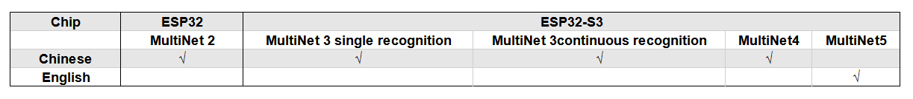

# MultiNet 介绍 [[English]](./README.md)

MultiNet 是为了在 ESP32 系列上离线实现多命令词识别而设计的轻量化模型，目前支持 200 个以内的自定义命令词识别。

> 支持中文和英文命令词识别（英文命令词识别需使用 ESP32S3）  
> 支持用户自定义命令词  
> 支持运行过程中 增加/删除/修改 命令词语  
> 最多支持 200 个命令词  
> 支持单次识别和连续识别两种模式  
> 轻量化，低资源消耗  
> 低延时，延时500ms内  
> 支持在线中英文模型切换（仅 ESP32S3）  
> 模型单独分区，支持用户应用 OTA

## 1. 概述

MultiNet 输入为经过前端语音算法（AFE）处理过的音频，格式为 16KHz，16bit，单声道。通过对音频进行识别，则可以对应到相应的汉字或单词。  

以下表格展示在不同芯片上的模型支持：



用户选择不同的模型的方法请参考 [flash model](../flash_model/README_CN.md) 。

**注：其中以 `Q8` 结尾的模型代表模型的 8bit 版本，表明该模型更加轻量化。**

## 2. 命令词识别原理

可以参考以下命令词识别原理：


## 3. 使用指南

### 3.1 命令词设计要求

- 中文推荐长度一般为 4-6 个汉字，过短导致误识别率高，过长不方便用户记忆
- 英文推荐长度一般为 4-6 个单词
- 命令词中不支持中英文混合
- 目前最多支持 **200** 条命令词
- 命令词中不能含有阿拉伯数字和特殊字符
- 命令词避免使用常用语
- 命令词中每个汉字/单词的发音相差越大越好

### 3.2 命令词自定义方法

> 支持多种命令词自定义方法  
> 支持随时动态增加/删除/修改命令词

MultiNet 对命令词自定义方法没有限制，用户可以通过任意方式（在线/离线）等将所需的命令词按照相应的格式，组成链表发给 MultiNet 即可。

我们针对不同客户提供不同的 example 来展示一些命令词的自定义方法，大体分为以下两种。

#### 3.2.1 命令词格式

 命令词需要满足特定的格式，具体如下：
 
 - 中文
 
   中文命令词需要使用汉语拼音，并且每个字的拼音拼写间要间隔一个空格。比如“打开空调”，应该写成 "da kai kong tiao"，比如“打开绿色灯”，需要写成“da kai lv se deng”。
  
   **并且我们也提供相应的工具，供用户将汉字转换为拼音，详细可见：**

 - 英文
  
   英文命令词需要使用特定音标表示，每个单词的音标间用空格隔开，比如“turn on the light”，需要写成“TkN nN jc LiT”。
  
   **我们提供了具体转换规则和工具，详细可以参考[英文转音素工具](../../tool/multinet_g2p.py) 。**

#### 3.2.2 离线设置命令词

MultiNet 支持多种且灵活的命令词设置方式，用户无论通过那种方式编写命令词（代码/网络/文件），只需调用相应的 API 即可。

在这里我们提供两种常见的命令词添加方法。

- 编写 `menuconfig` 进行添加
 
   可以参考 ESP-Skainet 中 example 通过 `idf.py menuconfig -> ESP Speech Recognition-> Add Chinese speech commands/Add English speech commands` 添加命令词。

    
  
    请注意单个 Command ID 可以支持多个短语，比如“打开空调”和“开空调”表示的意义相同，则可以将其写在同一个 Command ID 对应的词条中，用英文字符“,”隔开相邻词条（“,”前后无需空格）。
  
    然后通过在代码里调用以下 API 即可：
  
    ```
     /**
      * @brief Update the speech commands of MultiNet by menuconfig
      *
      * @param multinet            The multinet handle
      *
      * @param model_data          The model object to query
      *
      * @param langugae            The language of MultiNet
      *
      * @return
      *     - ESP_OK                  Success
      *     - ESP_ERR_INVALID_STATE   Fail
      */
      esp_err_t esp_mn_commands_update_from_sdkconfig(esp_mn_iface_t *multinet, const model_iface_data_t *model_data);
    ```

- 通过自己创建命令词进行添加

   可以参考 ESP-Skainet 中 example 了解这种添加命令词的方法。
 
   该方法中，用户直接在代码中编写命令词，并传给 MultiNet，在实际开发和产品中，用户可以通过网络/UART/SPI等多种可能的方式传递所需的命令词并随时更换命令词。
 
#### 3.2.3 在线设置命令词
 
 MultiNet 支持在运行过程中在线动态添加/删除/修改命令词，该过程无须更换模型和调整参数。具体可以参考 ESP-Skainet 中 example。
 
 具体API说明请参考　[esp_mn_speech_commands](../../src/esp_mn_speech_commands.c)：
 

## 4. 运行命令词识别

命令词识别需要和 ESP-SR 中的声学算法模块（AFE）（AFE中需使能唤醒（WakeNet））一起运行。关于 AFE 的使用，请参考文档：

[AFE 介绍及使用](../audio_front_end/README_CN.md)  

当用户配置完成 AFE 后，请按照以下步骤配置和运行 MultiNet：

### 4.1 MultiNet 初始化

- 模型加载与初始化　　　
  请参考[flash_model](../flash_model/README_CN.md)

- 设置命令词
 请参考上文 #3。

### 4.2 MultiNet 运行

 当用户开启 AFE 且使能 WakeNet 后，则可以运行 MultiNet。且有以下几点要求：
 
 > 传入帧长和 AFE fetch 帧长长度相等  
 > 支持音频格式为 16KHz，16bit，单通道。AFE fetch 拿到的数据也为这个格式
 
 - 确定需要传入 MultiNet 的帧长

   ```
   int mu_chunksize = multinet->get_samp_chunksize(model_data);
   ```
 
   `mu_chunksize` 是需要传入 MultiNet 的每帧音频的 `short` 型点数，这个大小和 AFE 中 fetch 的每帧数据点数完全一致。
 
 - MultiNet detect

   我们将 AFE 实时 `fetch` 到的数据送入以下 API：
 
   ```
    esp_mn_state_t mn_state = multinet->detect(model_data, buff);
   ```
 
 `buff` 的长度为 `mu_chunksize * sizeof(int16_t)`。

### 4.3 MultiNet 识别结果

命令词识别支持两种基本模式：

> 单次识别  
> 连续识别

命令词识别必须和唤醒搭配使用，当唤醒后可以运行命令词的检测。

命令词模型在运行时，会实时返回当前帧的识别状态 `mn_state`，目前分为以下几种识别状态：

- ESP_MN_STATE_DETECTING
 
  该状态表示目前正在识别中，还未识别到目标命令词。


- ESP_MN_STATE_DETECTED

   该状态表示目前识别到了目标命令词，此时用户可以调用 `get_results` 接口获取识别结果。
 
   ```
   esp_mn_results_t *mn_result = multinet->get_results(model_data);
   ```
 
   识别结果的信息存储在 `get_result` API 的返回值中，返回值的数据类型如下：
 
   ```
   typedef struct{
      esp_mn_state_t state;
      int num;                // The number of phrase in list, num<=5. When num=0, no phrase is recognized.
      int phrase_id[ESP_MN_RESULT_MAX_NUM];      // The list of phrase id.
      float prob[ESP_MN_RESULT_MAX_NUM];         // The list of probability.
   } esp_mn_results_t;
   ```
 
    - 其中 `state` 为当前识别的状态
    - `num`表示识别到的词条数目，`num` <= 5，即最多返回 5 个候选结果
    - `phrase_id` 表示识别到的词条对应的 Phrase ID
    - `prob` 表示识别到的词条识别概率，从大到到小依次排列

  用户可以使用 `phrase_id[0]` 和 `prob[0]` 拿到概率最高的识别结果。

- ESP_MN_STATE_TIMEOUT

    该状态表示长时间未检测到命令词，自动退出。等待下次唤醒。

因此：  
当命令词识别返回状态为 `ESP_MN_STATE_DETECTED` 时退出命令词识别，则为单次识别模式；  
当命令词识别返回状态为 `ESP_MN_STATE_TIMEOUT` 时退出命令词识别，则为连续识别模式；

## 5. 其他配置和使用

### 5.1 阈值设置

　　该功能仍在开发中．
