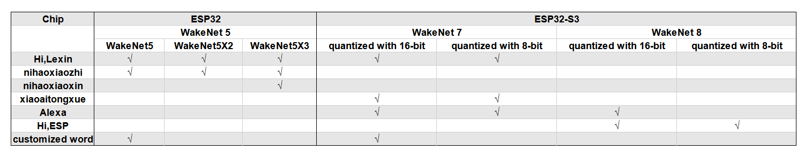

# WakeNet [[English]](./README.md)

WakeNet是一个基于神经网络，为低功耗嵌入式MCU设计的的唤醒词模型，目前支持5个以内的唤醒词识别。

## Overview

WakeNet的流程图如下：
<center>

</center>


- speech features：  
  我们使用[MFCC](https://en.wikipedia.org/wiki/Mel-frequency_cepstrum)方法提取语音频谱特征。输入的音频文件采样率为16KHz，单声道，编码方式为signed 16-bit。每帧窗宽和步长均为30ms。    

- neural network：  
  神经网络结构已经更新到第6版，其中：  
  - wakeNet1,wakeNet2,wakeNet3,wakeNet4已经停止使用。
  - wakeNet5应用于ESP32芯片。
  - wakeNet8和wakeNet9应用于ESP32S3芯片，模型基于　[Dilated Convolution](https://arxiv.org/pdf/1609.03499.pdf) 结构。
  
  注意，WakeNet5,WakeNet5X2 和 WakeNet5X3 的网络结构一致，但是 WakeNet5X2 和 WakeNet5X3 的参数比 WakeNet5 要多。请参考 [性能测试](#性能测试) 来获取更多细节。
         
- keyword trigger method：  
  对连续的音频流，为准确判断关键词的触发，我们通过计算若干帧内识别结果的平均值M，来判断触发。当M大于大于指定阈值，发出触发的命令。

以下表格展示在不同芯片上的模型支持：



## WakeNet使用

- WakeNet 模型选择  
  
  WakeNet 模型选择请参考 [Flash model 介绍](../flash_model/README_CN.md) 。

  对于自定义的唤醒词，请参考[乐鑫语音唤醒词定制流程](乐鑫语音唤醒词定制流程.md)。
  
- WakeNet 运行

  WakeNet 目前包含在语音前端算法 [AFE](../audio_front_end/README_CN.md) 中，默认为运行状态，并将识别结果通过 AFE fetch 接口返回。
  
  如果用户需要关掉 WakeNet，请在 AFE	配置时选择：
  
  ```
  afe_config.wakenet_init = False.
  ```
  
  即可停止运行 WakeNet。

## 性能测试

具体请参考 [Performance_test](../performance_test/README.md)。

## 唤醒词定制

如果需要定制唤醒词，请参考[乐鑫语音唤醒词定制流程](乐鑫语音唤醒词定制流程.md)。

