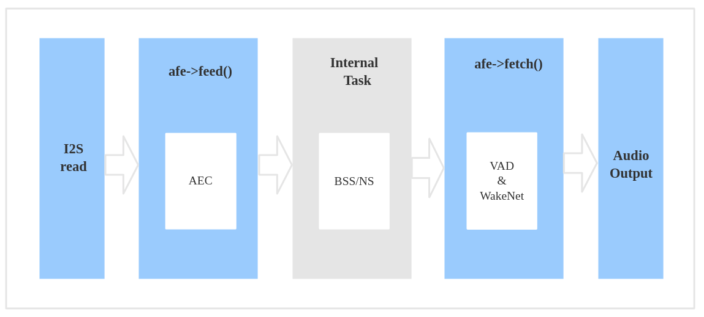
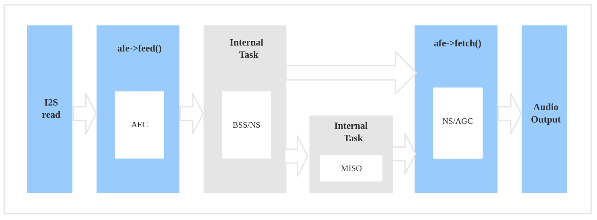
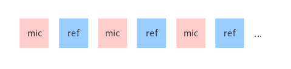
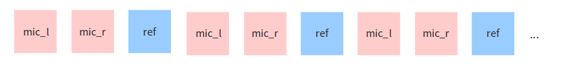

AFE 声学前端算法框架
====================

:link_to_translation:`en:[English]`

概述
----

智能语音设备需要在远场噪声环境中，仍具备出色的语音交互性能，声学前端 (Audio Front-End, AFE) 算法在构建此类语音用户界面 (Voice-User Interface, VUI) 时至关重要。乐鑫 AI 实验室自主研发了一套乐鑫 AFE 算法框架，可基于功能强大的 {IDF_TARGET_NAME} 系列芯片进行声学前端处理，使用户获得高质量且稳定的音频数据，从而构建性能卓越且高性价比的智能语音产品。

.. list-table::
    :widths: 25 75
    :header-rows: 1

    * - 名称
      - 简介
    * - AEC (Acoustic Echo Cancellation)
      - 回声消除算法，最多支持双麦处理，能够有效的去除 mic 输入信号中的自身播放声音，从而可以在自身播放音乐的情况下很好的完成语音识别。
    * - NS (Noise Suppression)
      - 噪声抑制算法，支持单通道处理，能够对单通道音频中的非人声噪声进行抑制，尤其针对稳态噪声，具有很好的抑制效果。
    * - BSS (Blind Source Separation)
      - 盲信号分离算法，支持双通道处理，能够很好的将目标声源和其余干扰音进行盲源分离，从而提取出有用音频信号，保证了后级语音的质量。
    * - MISO (Multi Input Single Output)
      - 多输入单输出算法，支持双通道输入，单通道输出。用于在双麦场景，没有唤醒使能的情况下，选择信噪比高的一路音频输出。
    * - VAD (Voice Activity Detection)
      - 语音活动检测算法，支持实时输出当前帧的语音活动状态。
    * - AGC (Automatic Gain Control)
      - 自动增益控制算法，可以动态调整输出音频的幅值，当弱信号输入时，放大输出幅度；当输入信号达到一定强度时，压缩输出幅度。
    * - WakeNet
      - 基于神经网络的唤醒词模型，专为低功耗嵌入式 MCU 设计

使用场景
--------

本节将介绍乐鑫 AFE 框架的两个典型使用场景。

语音识别场景
^^^^^^^^^^^^

工作流程
""""""""

.. figure:: ../../_static/AFE_SR_overview.png
    :alt: overview

数据流
""""""

#. 使用 :cpp:func:`ESP_AFE_SR_HANDLE`，创建并初始化 AFE。注意， :cpp:member:`voice_communication_init` 需配置为 false。
#. 使用 :cpp:func:`feed`，输入音频数据。feed 内部会先进行 AEC 算法处理
#. Feed 内部进行 BSS/NS 算法处理
#. 使用 :cpp:func:`fetch`，获得经过处理过的单通道音频数据及相关信息。这里，fetch 内部可以进行 VAD 处理并检测唤醒词等动作，具体可通过 :cpp:type:`afe_config_t` 结构体配置。

语音通话场景
^^^^^^^^^^^^

工作流程
""""""""

.. figure:: ../../_static/AFE_VOIP_overview.png
    :alt: overview

数据流
""""""

#. 使用 :cpp:func:`ESP_AFE_VC_HANDLE`，创建并初始化 AFE。注意， :cpp:member:`voice_communication_init` 需配置为 true。
#. 使用 :cpp:func:`feed`，输入音频数据。feed 内部会先进行 AEC 算法处理
#. Feed 内部进行 BSS/NS 算法处理。若为双麦，还将额外进行 MISO 算法处理。
#. 使用 :cpp:func:`fetch`，获得经过处理过的单通道音频数据及相关信息。这里，可对输出数据进行 AGC 非线性放大，具体增益值可通过 :cpp:type:`afe_config_t` 结构体配置。注意，若为双麦，则在进行 AGC 非线性放大前还会进行降噪处理。

.. note::
    #. :cpp:type:`afe_config_t` 结构体中的 :cpp:member:`wakenet_init` 和 :cpp:member:`voice_communication_init` 不可同时配置为 true。
    #. :cpp:func:`feed` 和 :cpp:func:`fetch` 对用户可见，其他内部 BSS/NS/MISO 算法处理为 AFE 的内部独立任务，对用户不可见。
    #. AEC 算法处理在 :cpp:func:`feed` 中进行。
    #. 当 :cpp:member:`aec_init` 配置为 false，BSS/NS 算法处理在 :cpp:func:`feed` 中进行。

选择 AFE Handle
---------------

目前，乐鑫 AFE 框架支持单麦和双麦配置，并允许对算法模块进行灵活配置。

* 单麦配置：
   * 内部 Task 由 NS 算法模块处理
* 双麦配置：
   * 内部 Task 由 BSS 算法模块处理
   * 此外，如用于语音通话场景（即 :cpp:member:`wakenet_init` = false 且 :cpp:member:`voice_communication_init` = true），则会再增加一个内部 Task 由 MISO 处理。

获取 AFE handle 的命令如下：

* 语音识别场景

    ::

        esp_afe_sr_iface_t *afe_handle = &ESP_AFE_SR_HANDLE;

* 语音通话场景

    ::

        esp_afe_sr_iface_t *afe_handle = &ESP_AFE_VC_HANDLE;

.. _input-audio-1:

输入音频
--------

目前，乐鑫 AFE 框架支持单麦和双麦配置，可根据 :cpp:func:`esp_afe_sr_iface_op_feed_t` 的输入音频情况，配置所需的音频通道数。

具体方式为：
配置 :cpp:func:`AFE_CONFIG_DEFAULT()` 中的 :cpp:member:`pcm_config` 结构体成员：

* :cpp:member:`total_ch_num`：总通道数
* :cpp:member:`mic_num`：麦克风通道数
* :cpp:member:`ref_num`：参考回路通道数

注意，在配置时有如下要求：

1. :cpp:member:`total_ch_num` = :cpp:member:`mic_num` + :cpp:member:`ref_num`
2. :cpp:member:`ref_num` = 0 或 :cpp:member:`ref_num` = 1 （由于目前 AEC 仅只支持单回路）

在上述要求下，几种支持的配置组合如下：

::

    total_ch_num=1, mic_num=1, ref_num=0
    total_ch_num=2, mic_num=1, ref_num=1
    total_ch_num=2, mic_num=2, ref_num=0
    total_ch_num=3, mic_num=2, ref_num=1

AFE 单麦配置
^^^^^^^^^^^^
* 输入音频的 **格式** 为 16 KHz、16 bit、双通道（其中 1 个通道为 mic 数据，另 1 个通道为参考回路）。注意，若不需要 AEC 功能，则可只包含 1 个通道输入 mic 数据，而无需配置参考回路（即可配置 :cpp:member:`ref_num` = 0）。
* 根据用户配置的算法模块不同，输入音频的 **帧长** 将有所差异，具体可通过 :cpp:func:`get_feed_chunksize` 来获取需要的采样点数目（采样点数据类型为 ``int16``）。

数据排布示意如下：

AFE 双麦配置
^^^^^^^^^^^^
* 输入音频格式为 16 KHz、16 bit、三通道（其中 2 个通道为 mic 数据，另 1 个通道为参考回路）。注意，若不需要 AEC 功能，则可只包含 2 个通道 mic 数据，而无需配置参考回路（即可配置 :cpp:member:`ref_num` = 0）。
* 根据用户配置的算法模块不同，输入音频的 **帧长** 将有所差异，具体可通过 :cpp:func:`get_feed_chunksize` 来获取需要填充的数据量（即 :cpp:func:`get_feed_chunksize` * :cpp:member:`total_ch_num` * sizeof(short)）。

数据排布示意如下：

输出音频
--------

AFE 的输出音频为单通道数据：

* 语音识别场景：在 WakeNet 开启的情况下，输出有目标人声的单通道数据
* 语音通话场景：输出信噪比更高的单通道数据

使能唤醒词识别 WakeNet
----------------------

在进行 AFE 声学前端处理时，用户可选择是否使能 :doc:`WakeNet <../wake_word_engine/README>` 进行唤醒词识别。

当用户在唤醒后需要进行其他操作，比如离线或在线语音识别，这时候可以暂停 WakeNet 的运行，从而减轻 CPU 的资源消耗。此时，仅需调用 :cpp:func:`disable_wakenet()`，进入 Bypass 模式。

当后续应用结束后又可以调用 :cpp:func:`enable_wakenet()` 再次使能 WakeNet。

.. only:: esp32

    ESP32 芯片只支持一个唤醒词，不支持唤醒词切换。

.. only:: esp32s3

    ESP32-S3 芯片支持唤醒词切换。在 AFE 初始化完成后，ESP32-S3 芯片可允许用户通过 :cpp:func:`set_wakenet()` 函数切换唤醒词。例如， ``set_wakenet(afe_data, “wn9_hilexin”)`` 切换到 “Hi Lexin” 唤醒词。有关如何配置多个唤醒词的详细介绍，请见 :doc:`模型加载 <../flash_model/README>`。

使能回声消除算法 AEC
--------------------

AEC 的使用和 WakeNet 相似，用户可以根据自己的需求来停止或开启 AEC。

-  停止 AEC

    ``afe->disable_aec(afe_data);``

-  开启 AEC

    ``afe->enable_aec(afe_data);``

.. only:: html

    编程指南
    --------

    定义 afe_handle 函数句柄
    ^^^^^^^^^^^^^^^^^^^^^^^^

    首先配置 ``afe_handle`` 函数句柄，后续才可以调用 afe 接口。具体配置方式如下：

    - 语音识别

        ::

            esp_afe_sr_iface_t *afe_handle = &ESP_AFE_SR_HANDLE;

    - 语音通话

        ::

            esp_afe_sr_iface_t *afe_handle = &ESP_AFE_VC_HANDLE;

    配置 afe
    ^^^^^^^^

    配置 afe：

    ::

        afe_config_t afe_config = AFE_CONFIG_DEFAULT();

    其中，``afe_config`` 中各算法模块的使能及其相应参数可以单独调整：

    ::

        #define AFE_CONFIG_DEFAULT() { \
            // 配置是否使能 AEC
            .aec_init = true, \
            // 配置是否使能 BSS/NS
            .se_init = true, \
            // 配置是否使能 VAD（仅用于语音识别场景）
            .vad_init = true, \
            // 配置是否使能唤醒
            .wakenet_init = true, \
            // 配置是否使能语音通话（不可与 wakenet_init 同时使能）
            .voice_communication_init = false, \
            // 配置是否使能语音通话中 AGC
            .voice_communication_agc_init = false, \
            // 配置 AGC 的增益值（单位为 dB）
            .voice_communication_agc_gain = 15, \
            // 配置 VAD 检测的操作模式，越大越激进
            .vad_mode = VAD_MODE_3, \
            // 配置唤醒模型，详见下方描述
            .wakenet_model_name = NULL, \
            // 配置唤醒模式（对应为多少通道的唤醒，根据mic通道的数量选择）
            .wakenet_mode = DET_MODE_2CH_90, \
            // 配置 AFE 工作模式（SR_MODE_LOW_COST 或 SR_MODE_HIGH_PERF）
            .afe_mode = SR_MODE_LOW_COST, \
            // 配置运行 AFE 内部 BSS/NS/MISO 算法的 CPU 核
            .afe_perferred_core = 0, \
            // 配置运行 AFE 内部 BSS/NS/MISO 算法的 task 优先级
            .afe_perferred_priority = 5, \
            // 配置内部 ringbuf
            .afe_ringbuf_size = 50, \
            // 配置内存分配模式，详见下方描述
            .memory_alloc_mode = AFE_MEMORY_ALLOC_MORE_PSRAM, \
            // 配置音频线性放大 Level，详见下方描述
            .agc_mode = AFE_MN_PEAK_AGC_MODE_2, \
            // 配置音频总的通道数
            .pcm_config.total_ch_num = 3, \
            // 配置音频麦克风的通道数
            .pcm_config.mic_num = 2, \
            // 配置音频参考回路通道数
            .pcm_config.ref_num = 1, \
            // 配置NS算法的模式，NS_MODE_SSP为信号处理算法，NS_MODE_NET为基于网络的降噪算法
            .afe_ns_mode = NS_MODE_SSP, \
            // 降噪网络的模型名字，默认为"nsnet1"
            .afe_ns_model_name = "nsnet1", \
        }

    *  :cpp:member:`wakenet_model_name` ：配置唤醒模型。宏 :cpp:type:`AFE_CONFIG_DEFAULT()` 中该值默认为 NULL。注意：
        * 在使用 ``idf.py menuconfig`` 选择了相应的唤醒模型后，在调用 :cpp:member:`create_from_config` 之前，需要将此值配置为具体的模型名称，类型为字符串形式。有关唤醒模型的详细介绍，请见：:doc:`模型加载 <../flash_model/README>` 。
        * :cpp:func:`esp_srmodel_filter()` 可用于获取模型名称。但若 ``idf.py menuconfig`` 中选择了多模型共存，则该函数将会随机返回一个模型名称。

    *  :cpp:member:`afe_mode` ：配置 AFE 工作模式：

        .. list::

            :esp32s3: - :cpp:enumerator:`SR_MODE_LOW_COST` ：量化版本，占用资源较少。
            - :cpp:enumerator:`SR_MODE_HIGH_PERF` ：非量化版本，占用资源较多。

        详情可见 :cpp:enumerator:`afe_sr_mode_t` 。

    *  :cpp:member:`memory_alloc_mode` ：配置内存分配的模式：
        -  :cpp:enumerator:`AFE_MEMORY_ALLOC_MORE_INTERNAL` ：更多从内部 ram 分配
        -  :cpp:enumerator:`AFE_MEMORY_ALLOC_INTERNAL_PSRAM_BALANCE` ：部分从内部 ram 分配
        -  :cpp:enumerator:`AFE_MEMORY_ALLOC_MORE_PSRAM` ：更多从外部 psram 分配

    -  :cpp:member:`agc_mode` ：配置音频线性放大的 level。注意，该配置仅适用语音识别场景下，且在唤醒使能时才生效。可配置四个值：
        -  :cpp:enumerator:`AFE_MN_PEAK_AGC_MODE_1` ：线性放大喂给后续 MultiNet 的音频，峰值处为 -5 dB。
        -  :cpp:enumerator:`AFE_MN_PEAK_AGC_MODE_2` ：线性放大喂给后续 MultiNet 的音频，峰值处为 -4 dB。
        -  :cpp:enumerator:`AFE_MN_PEAK_AGC_MODE_3` ：线性放大喂给后续 MultiNet 的音频，峰值处为 -3 dB。
        -  :cpp:enumerator:`AFE_MN_PEAK_NO_AGC` ：不做线性放大

    -  :cpp:member:`pcm_config` ：根据 :cpp:func:`feed` 喂入的音频结构进行配置，该结构体有三个成员变量需要配置：
        -  :cpp:member:`total_ch_num` ：音频的总通道数
        -  :cpp:member:`mic_num` ：音频的麦克风通道数
        -  :cpp:member:`ref_num` ：音频的参考回路通道数

        在配置时有一定注意事项，详见 :ref:`input-audio-1`。

    创建 afe_data
    ^^^^^^^^^^^^^

    使用上一步配置好的 afe 语句创建函数句柄，使用函数为 :cpp:func:`esp_afe_sr_iface_op_create_from_config_t` 。

    ::

        /**
        * @brief Function to initialze a AFE_SR instance
        *
        * @param afe_config        The config of AFE_SR
        * @returns Handle to the AFE_SR data
        */
        typedef esp_afe_sr_data_t* (*esp_afe_sr_iface_op_create_from_config_t)(afe_config_t *afe_config);

    feed 音频数据
    ^^^^^^^^^^^^^

    在初始化 AFE 完成后，使用 :cpp:func:`feed` 函数，将音频数据输入到 AFE 模块中进行处理。输入音频的格式详见 :ref:`input-audio-1` 。

    ::

        /**
        * @brief Feed samples of an audio stream to the AFE_SR
        *
        * @Warning  The input data should be arranged in the format of channel interleaving.
        *           The last channel is reference signal if it has reference data.
        *
        * @param afe   The AFE_SR object to query
        *
        * @param in    The input microphone signal, only support signed 16-bit @ 16 KHZ. The frame size can be queried by the
        *              `get_feed_chunksize`.
        * @return      The size of input
        */
        typedef int (*esp_afe_sr_iface_op_feed_t)(esp_afe_sr_data_t *afe, const int16_t* in);

    获取音频通道数
    ^^^^^^^^^^^^^^

    使用 :cpp:func:`get_total_channel_num()` 函数获取需要传入 :cpp:func:`feed()` 函数的音频总通道数，其返回值等于 :cpp:func:`AFE_CONFIG_DEFAULT()` 中配置的 ``pcm_config.mic_num + pcm_config.ref_num`` 。

    ::

        /**
        * @brief Get the total channel number which be config
        *
        * @param afe   The AFE_SR object to query
        * @return      The amount of total channels
        */
        typedef int (*esp_afe_sr_iface_op_get_total_channel_num_t)(esp_afe_sr_data_t *afe);

    fetch 音频数据
    ^^^^^^^^^^^^^^

    用户调用 :cpp:func:`fetch` 函数，获取经过处理过的单通道音频数据及相关信息。

    :cpp:func:`fetch` 的数据采样点数目（采样点数据类型为 ``int16``）可以通过 :cpp:func:`get_feed_chunksize` 获取。

    ::

        /**
        * @brief Get the amount of each channel samples per frame that need to be passed to the function
        *
        * Every speech enhancement AFE_SR processes a certain number of samples at the same time. This function
        * can be used to query that amount. Note that the returned amount is in 16-bit samples, not in bytes.
        *
        * @param afe The AFE_SR object to query
        * @return The amount of samples to feed the fetch function
        */
        typedef int (*esp_afe_sr_iface_op_get_samp_chunksize_t)(esp_afe_sr_data_t *afe);

    :cpp:func:`fetch` 的函数声明如下：

    ::

        /**
        * @brief fetch enhanced samples of an audio stream from the AFE_SR
        *
        * @Warning  The output is single channel data, no matter how many channels the input is.
        *
        * @param afe   The AFE_SR object to query
        * @return      The result of output, please refer to the definition of `afe_fetch_result_t`. (The frame size of output audio can be queried by the `get_fetch_chunksize`.)
        */
        typedef afe_fetch_result_t* (*esp_afe_sr_iface_op_fetch_t)(esp_afe_sr_data_t *afe);

    其返回值为结构体指针，结构体定义如下：

    ::

        /**
        * @brief The result of fetch function
        */
        typedef struct afe_fetch_result_t
        {
            int16_t *data;                          // the data of audio.
            int data_size;                          // the size of data. The unit is byte.
            int wakeup_state;                       // the value is wakenet_state_t
            int wake_word_index;                    // if the wake word is detected. It will store the wake word index which start from 1.
            int vad_state;                          // the value is afe_vad_state_t
            int trigger_channel_id;                 // the channel index of output
            int wake_word_length;                   // the length of wake word. It's unit is the number of samples.
            int ret_value;                          // the return state of fetch function
            void* reserved;                         // reserved for future use
        } afe_fetch_result_t;

资源消耗
--------

有关本模型的资源消耗情况，请见 :doc:`资源消耗 <../benchmark/README>`。