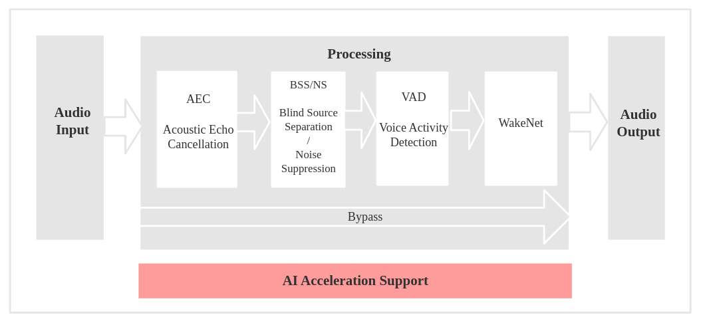
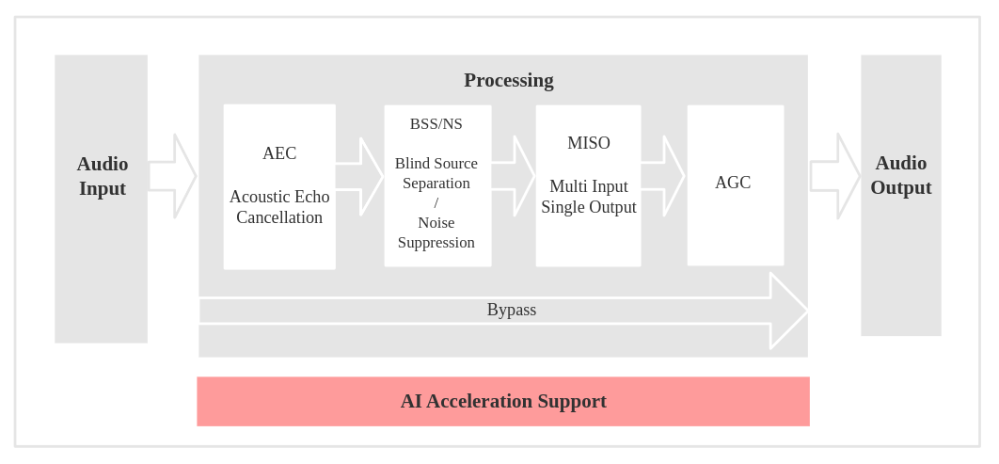

Audio Front-end 框架
====================

:link_to_translation:`en:[English]`

乐鑫 Audio Front-end (AFE) 算法框架由乐鑫 AI 实验室自主开发。该框架基于 ESP32 系列芯片，能够提供高质量并且稳定的音频数据。

概述
----

乐鑫 AFE 框架基于乐鑫的 ESP32 系列芯片，可以以最便捷的方式进行语音前端处理。使用乐鑫 AFE 框架，您可以获取高质量且稳定的音频数据，从而更加方便地构建唤醒或语音识别等应用。

乐鑫 AFE 主要有两个使用场景。

语音识别场景
^^^^^^^^^^^^

数据流
""""""
.. figure:: ../../_static/AFE_SR_workflow.png
    :alt: overview

工作流程
""""""""

#. 使用 **ESP_AFE_SR_HANDLE**，进行 AFE 的创建和初始化（注意， ``voice_communication_init`` 需配置为 false）
#. AFE feed，输入音频数据，feed 内部会先进行 AEC 算法处理
#. 内部: 进行 BSS/NS 算法处理
#. AFE fetch，返回处理过的单通道音频数据和相关信息， fetch 内部会进行 VAD 处理，以及唤醒词的检测，具体行为取决于用户对 ``afe_config_t`` 结构体的配置。（注意： ``wakenet_init`` 和 ``voice_communication_init`` 不可同时配置为 true）。

语音通话场景
^^^^^^^^^^^^

数据流
""""""
.. figure:: ../../_static/AFE_VOIP_workflow.png
    :alt: overview

工作流程
""""""""
#. 使用 **ESP_AFE_VC_HANDLE** ，进行 AFE 的创建和初始化 (``voice_communication_init`` 需配置为 true )
#. AFE feed，输入音频数据，feed 内部会先进行 AEC 算法处理
#. 内部: 首先进行 BSS/NS 算法处理；若为双麦，随后还会进行 MISO 算法处理；
#. AFE fetch，返回处理过的单通道音频数据和相关信息。其中会进行 AGC 非线性放大，具体增益值取决于用户对 ``afe_config_t`` 结构体的配置；若为双麦，在 AGC 之前还会进行降噪处理。（注： ``wakenet_init`` 和 ``voice_communication_init`` 不可同时配置为 true）

.. note::
    ``afe->feed()`` 和 ``afe->fetch()`` 对用户可见， ``Internal BSS/NS/MISO Task`` 对用户不可见。

    * AEC 在 ``afe->feed()`` 函数中运行；若 ``aec_init`` 配置为 false 状态，BSS/NS 将会在 ``afe->feed()`` 函数中运行。
    * BSS/NS/MISO 作为 AFE 内部独立 Task 进行处理。
    * VAD/WakeNet 的结果，以及处理后的单通道音频，通过 ``afe->fetch()`` 函数获取。

选择 AFE Handle
---------------

目前 AFE 支持单麦和双麦配置，并且可对算法模块进行灵活配置。

* 单麦配置：
   * 内部 Task 由 NS 处理
* 双麦配置：
   * 双麦场景的内部 Task 由 BSS 处理
   * 此外，如用于语音通话场景（即 ``wakenet_init=false, voice_communication_init=true``），则会再增加一个 MISO 的内部 Task。

获取 AFE handle 的命令如下：

* 语音识别场景

    ::

        esp_afe_sr_iface_t *afe_handle = &ESP_AFE_SR_HANDLE;

* 语音通话场景

    ::

        esp_afe_sr_iface_t *afe_handle = &ESP_AFE_VC_HANDLE;

输入音频
--------

目前 AFE 支持单麦和双麦配置，可根据 ``afe->feed()`` 的音频，配置相应的音频通道数。

修改方式：在宏 ``AFE_CONFIG_DEFAULT()`` 中对 ``pcm_config`` 结构体成员进行配置修改。在配置时有如下要求：

1. ``total_ch_num = mic_num + ref_num``
2. ``ref_num = 0`` 或 ``ref_num = 1`` （由于目前 AEC 仅只支持单回路）

几种支持的配置组合如下：

几种支持的配置组合如下：

::

    total_ch_num=1, mic_num=1, ref_num=0
    total_ch_num=2, mic_num=1, ref_num=1
    total_ch_num=2, mic_num=2, ref_num=0
    total_ch_num=3, mic_num=2, ref_num=1

其中，
* ``total_ch_num``：总通道数
* ``mic_num``：麦克风通道数
* ``ref_num``：参考回路通道数

AFE 单麦场景
^^^^^^^^^^^^
* 输入音频格式为 16 KHz，16 bit，双通道（1 个通道为 mic 数据，另一个通道为参考回路）。注意，若不需要 AEC，则可只包含 1 个通道 mic 数据，而无需包含参考回路（即 ``ref_num = 0``）。
* 输入数据帧长，会根据用户配置的算法模块不同而有差异, 用户可以使用 ``afe->get_feed_chunksize`` 来获取需要的采样点数目（采样点数据类型为 int16）

数据排布示意如下：

.. figure:: ../../_static/AFE_mode_0.png
    :alt: input data of single MIC
    :height: 1.2in

AFE 双麦场景
^^^^^^^^^^^^
* 输入音频格式为 16 KHz，16 bit，三通道（2 个通道为 mic 数据，另一个通道为参考回路）。注意，若不需要 AEC，则可只包含 2 个通道 mic 数据，而无需包含参考回路（即 ``ref_num = 0``）。
* 输入数据帧长，会根据用户配置的算法模块不同而有差异，用户可以使用 ``afe->get_feed_chunksize`` 来获取需要填充的数据量

数据排布示意如下：

这里，数据量 = ``afe->get_feed_chunksize * 通道数 * sizeof(short)``

AEC 简介
""""""""
AEC (Acoustic Echo Cancellation) 算法最多支持双麦处理，能够有效的去除 mic 输入信号中的自身播放声音，从而可以在自身播放音乐的情况下很好的完成语音识别。

NS 简介
"""""""
NS (Noise Suppression) 算法支持单通道处理，能够对单通道音频中的非人声噪声进行抑制，尤其针对稳态噪声，具有很好的抑制效果。

BSS 简介
""""""""
BSS (Blind Source Separation) 算法支持双通道处理，能够很好的将目标声源和其余干扰音进行盲源分离，从而提取出有用音频信号，保证了后级语音的质量。

MISO 简介
"""""""""
MISO (Multi Input Single Output) 算法支持双通道输入，单通道输出。用于在双麦场景，没有唤醒使能的情况下，选择信噪比高的一路音频输出。

VAD 简介
""""""""
VAD (Voice Activity Detection) 算法支持实时输出当前帧的语音活动状态。

AGC 简介
""""""""
AGC (Automatic Gain Control) 动态调整输出音频的幅值，当弱信号输入时，放大输出幅度；当输入信号达到一定强度时，压缩输出幅度。

WakeNet 或 Bypass 简介
""""""""""""""""""""""
用户可以选择是否在 AFE 中进行唤醒词的识别。当用户调用 ``afe->disable_wakenet(afe_data)`` 后，则进入 Bypass 模式，此时 AFE 模块不会进行唤醒词的识别。

输出音频
--------

AFE 的输出音频为单通道数据。
* 语音识别场景：在 WakeNet 开启的情况下，输出有目标人声的单通道数据
* 语音通话场景：输出信噪比更高的单通道数据

.. only:: html

    快速开始
    --------

    定义 afe_handle
    ^^^^^^^^^^^^^^^

    ``afe_handle`` 是用户后续调用 afe 接口的函数句柄。所以第一步需先获得 ``afe_handle``。

    - 语音识别

        ::

            esp_afe_sr_iface_t *afe_handle = &ESP_AFE_SR_HANDLE;

    - 语音通话

        ::

            esp_afe_sr_iface_t *afe_handle = &ESP_AFE_VC_HANDLE;

    配置 afe
    ^^^^^^^^

    获取 afe 的配置：

    ::

        afe_config_t afe_config = AFE_CONFIG_DEFAULT();

    其中，``afe_config`` 中各算法模块的使能及其相应参数可以单独调整：

    ::

        #define AFE_CONFIG_DEFAULT() { \
            // 配置是否使能 AEC
            .aec_init = true, \
            // 配置是否使能 BSS/NS
            .se_init = true, \
            // 配置是否使能 VAD（仅用于语音识别场景）
            .vad_init = true, \
            // 配置是否使能唤
            .wakenet_init = true, \
            // 配置是否使能语音通话（不可与 wakenet_init 同时使能）
            .voice_communication_init = false, \
            // 配置是否使能语音通话中 AGC
            .voice_communication_agc_init = false, \
            // 配置 AGC 的增益值（单位为 dB）
            .voice_communication_agc_gain = 15, \
            // 配置 VAD 检测的操作模式，越大越激进
            .vad_mode = VAD_MODE_3, \
            //
            .wakenet_model_name = NULL, \
            // 配置唤醒模式（对应为多少通道的唤醒，根据mic通道的数量选择）
            .wakenet_mode = DET_MODE_2CH_90, \
            // 配置 AFE 工作模式（SR_MODE_LOW_COST 或 SR_MODE_HIGH_PERF）
            .afe_mode = SR_MODE_LOW_COST, \
            // 配置运行 AFE 内部 BSS/NS/MISO 算法的 CPU 核
            .afe_perferred_core = 0, \
            // 配置运行 AFE 内部 BSS/NS/MISO 算法的 task 优先级
            .afe_perferred_priority = 5, \
            // 配置内部 ringbuf
            .afe_ringbuf_size = 50, \
            // 配置内存分配模式，详见下方描述
            .memory_alloc_mode = AFE_MEMORY_ALLOC_MORE_PSRAM, \
            // 配置音频线性放大 Level，详见下方描述
            .agc_mode = AFE_MN_PEAK_AGC_MODE_2, \
            // 配置音频总的通道数
            .pcm_config.total_ch_num = 3, \
            // 配置音频麦克风的通道数
            .pcm_config.mic_num = 2, \
            // 配置音频参考回路通道数
            .pcm_config.ref_num = 1, \
        }

    -  wakenet_model_name: 宏 ``AFE_CONFIG_DEFAULT()`` 中该值默认为 NULL。使用 ``idf.py menuconfig`` 选择了相应的唤醒模型后，在调用 ``afe_handle->create_from_config`` 之前，需给该处赋值具体的模型名字，类型为字符串形式。唤醒模型的具体说明，详见：:doc:`flash_model <../flash_model/README>` （注意：示例代码中，使用了 ``esp_srmodel_filter()`` 获取模型名字，若 ``menuconfig`` 中选择了多个模型共存，该函数将会随机返回一个模型名字）
    -  afe_mode: 乐鑫 AFE 目前支持 2 种工作模式，分别为： ``SR_MODE_LOW_COS`` 和 ``SR_MODE_HIGH_PERF``。详细可见 ``afe_sr_mode_t`` 枚举。
        -  SR_MODE_LOW_COST: 量化版本，占用资源较少。
        -  SR_MODE_HIGH_PERF: 非量化版本，占用资源较多。

    .. note::
       ESP32 芯片，只支持 ``SR_MODE_HIGH_PERF`` 模式；ESP32-S3 芯片，两种模式均支持。

    -  memory_alloc_mode: 内存分配的模式。可配置三个值：
        -  AFE_MEMORY_ALLOC_MORE_INTERNAL：更多的从内部ram分配。

        -  AFE_MEMORY_ALLOC_INTERNAL_PSRAM_BALANCE：部分从内部ram分配。

        -  AFE_MEMORY_ALLOC_MORE_PSRAM：绝大部分从外部psram分配

    -  agc_mode: 将音频线性放大的 level 配置，该配置在语音识别场景下起作用，并且在唤醒使能时才生效。可配置四个值：

        -  AFE_MN_PEAK_AGC_MODE_1：线性放大喂给后续multinet的音频，峰值处为 -5 dB。

        -  AFE_MN_PEAK_AGC_MODE_2：线性放大喂给后续multinet的音频，峰值处为 -4 dB。

        -  AFE_MN_PEAK_AGC_MODE_3：线性放大喂给后续multinet的音频，峰值处为 -3 dB。

        -  AFE_MN_PEAK_NO_AGC：不做线性放大

    -  pcm_config: 根据 ``afe->feed()`` 喂入的音频结构进行配置，该结构体有三个成员变量需要配置：

        -  total_ch_num：音频总的通道数， ``total_ch_num = mic_num + ref_num``。

        -  mic_num: 音频的麦克风通道数。目前仅支持配置为 1 或 2。

        -  ref_num: 音频的参考回路通道数，目前仅支持配置为 0 或 1。

    创建 afe_data
    """""""""""""

    用户使用 ``afe_handle->create_from_config(&afe_config)`` 函数来获得数据句柄，这将会在afe内部使用，传入的参数即为上面第2步中获得的配置。

    ::

        /**
        * @brief Function to initialze a AFE_SR instance
        *
        * @param afe_config        The config of AFE_SR
        * @returns Handle to the AFE_SR data
        */
        typedef esp_afe_sr_data_t* (*esp_afe_sr_iface_op_create_from_config_t)(afe_config_t *afe_config);

    feed 音频数据
    """""""""""""

    在初始化 AFE 完成后，用户需要将音频数据使用 ``afe_handle->feed()`` 函数输入到 AFE 中进行处理。

    输入的音频大小和排布格式可以参考 **输入音频** 这一步骤。

    ::

        /**
        * @brief Feed samples of an audio stream to the AFE_SR
        *
        * @Warning  The input data should be arranged in the format of channel interleaving.
        *           The last channel is reference signal if it has reference data.
        *
        * @param afe   The AFE_SR object to query
        *
        * @param in    The input microphone signal, only support signed 16-bit @ 16 KHZ. The frame size can be queried by the
        *              `get_feed_chunksize`.
        * @return      The size of input
        */
        typedef int (*esp_afe_sr_iface_op_feed_t)(esp_afe_sr_data_t *afe, const int16_t* in);

    获取音频通道数
    """"""""""""""

    使用 ``afe_handle->get_total_channel_num()`` 函数可以获取需要传入 ``afe_handle->feed()`` 函数的总数据通道数。其返回值等于AFE_CONFIG_DEFAULT()中配置的 ``pcm_config.mic_num + pcm_config.ref_num``

    ::

        /**
        * @brief Get the total channel number which be config
        *
        * @param afe   The AFE_SR object to query
        * @return      The amount of total channels
        */
        typedef int (*esp_afe_sr_iface_op_get_total_channel_num_t)(esp_afe_sr_data_t *afe);

    fetch 音频数据
    """""""""""""""

    用户调用 ``afe_handle->fetch()`` 函数可以获取处理完成的单通道音频以及相关处理信息。

    fetch 的数据采样点数目（采样点数据类型为 int16）可以通过 ``afe_handle->get_fetch_chunksize`` 获取。

    ::

        /**
        * @brief Get the amount of each channel samples per frame that need to be passed to the function
        *
        * Every speech enhancement AFE_SR processes a certain number of samples at the same time. This function
        * can be used to query that amount. Note that the returned amount is in 16-bit samples, not in bytes.
        *
        * @param afe The AFE_SR object to query
        * @return The amount of samples to feed the fetch function
        */
        typedef int (*esp_afe_sr_iface_op_get_samp_chunksize_t)(esp_afe_sr_data_t *afe);

    ``afe_handle->fetch()`` 的函数声明如下：

    ::

        /**
        * @brief fetch enhanced samples of an audio stream from the AFE_SR
        *
        * @Warning  The output is single channel data, no matter how many channels the input is.
        *
        * @param afe   The AFE_SR object to query
        * @return      The result of output, please refer to the definition of `afe_fetch_result_t`. (The frame size of output audio can be queried by the `get_fetch_chunksize`.)
        */
        typedef afe_fetch_result_t* (*esp_afe_sr_iface_op_fetch_t)(esp_afe_sr_data_t *afe);

    其返回值为结构体指针，结构体定义如下：

    ::

        /**
        * @brief The result of fetch function
        */
        typedef struct afe_fetch_result_t
        {
            int16_t *data;                          // the data of audio.
            int data_size;                          // the size of data. The unit is byte.
            int wakeup_state;                       // the value is wakenet_state_t
            int wake_word_index;                    // if the wake word is detected. It will store the wake word index which start from 1.
            int vad_state;                          // the value is afe_vad_state_t
            int trigger_channel_id;                 // the channel index of output
            int wake_word_length;                   // the length of wake word. It's unit is the number of samples.
            int ret_value;                          // the return state of fetch function
            void* reserved;                         // reserved for future use
        } afe_fetch_result_t;

    WakeNet 使用
    """"""""""""

    当用户在唤醒后需要进行其他操作，比如离线或在线语音识别，这时候可以暂停 WakeNet 的运行，从而减轻 CPU 的资源消耗。

    用户可以调用 ``afe_handle->disable_wakenet(afe_data)`` 来停止 WakeNet。当后续应用结束后又可以调用 ``afe_handle->enable_wakenet(afe_data)`` 来开启 WakeNet。

    另外，ESP32-S3 芯片还可支持唤醒词切换。（ESP32 芯片只支持一个唤醒词，不支持切换）。在初始化 AFE 完成后，ESP32-S3 芯片可通过 ``set_wakenet()`` 函数切换唤醒词。例如, ``afe_handle->set_wakenet(afe_data, “wn9_hilexin”)`` 切换到 “Hi Lexin” 唤醒词。具体如何配置多个唤醒词，详见： :doc:`flash_model <../flash_model/README>`。

AEC 使用
--------

AEC 的使用和 WakeNet 相似，用户可以根据自己的需求来停止或开启 AEC。

-  停止 AEC

    ``afe->disable_aec(afe_data);``

-  开启 AEC

    ``afe->enable_aec(afe_data);``
