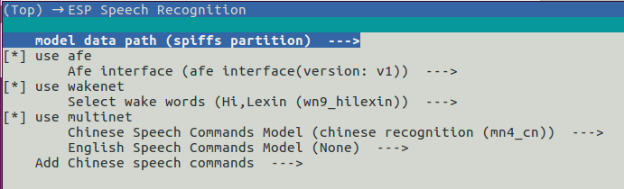
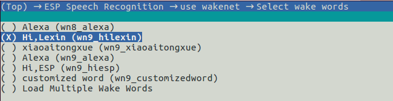
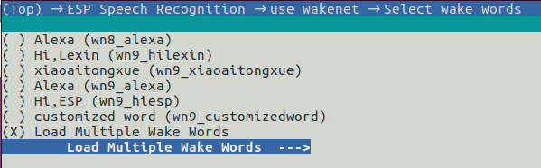
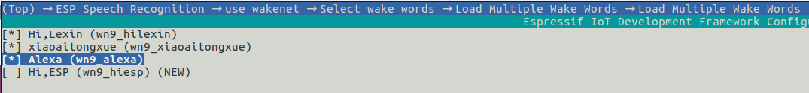

模型加载
========

:link_to_translation:`en:[English]`

在人工智能行业中，模型是指一个系统或过程的数学表示。它用于基于输入数据做出预测或决策，有许多不同类型的模型，如决策树、神经网络和支持向量机，每种模型都有其优缺点。乐鑫也提供经过训练的 WakeNet 和 MultiNet 模型（数据模型见 :project:`model`） 。

使用模型前需先将其加载至你的项目，目前 ESP-SR 支持以下模型加载方式：

.. only:: esp32

    ESP32：从 Flash 中直接加载

.. only:: esp32s3

    ESP32-S3：

    -  从 SPI 闪存文件系统 (SPIFFS) 分区加载
    -  从外部 SD 卡加载

    因此具有以下优势：

    -  大大减小用户应用 APP BIN 的大小
    -  支持选择最多两个唤醒词
    -  支持中文和英文命令词识别在线切换
    -  方便用户进行 OTA
    -  支持从 SD 卡读取和更换模型，更加便捷且可以缩减项目使用的模组 Flash 大小
    -  当用户进行开发时，当修改不涉及模型时，可以避免每次烧录模型数据，大大缩减烧录时间，提高开发效率

配置方法
--------

运行 ``idf.py menuconfig`` 进入 ``ESP Speech Recognition``:

    overview

.. only:: esp32s3

    Model Data Path
    ~~~~~~~~~~~~~~~

    该选项表示模型数据的存储位置，支持选择 ``spiffs partition`` 或 ``SD Card`` 。

    -  ``spiffs partition`` 表示模型数据存储在 SPIFFS 分区中，模型数据将会从 SPIFFS 分区中加载
    -  ``SD Card`` 表示模型数据存储在 SD 卡中，模型数据将会从 SD 卡中加载

使用 AFE
~~~~~~~~

此选项需要打开，用户无须修改，请保持默认配置。

使用 WakeNet
~~~~~~~~~~~~~

此选项默认打开。当用户只使用 AEC 或者 BSS 等，而无须运行 WakeNet 或 MultiNet 时，请关闭次选项，这将会减小工程固件的大小。

根据 ``menuconfig`` 列表选择唤醒词模型， ``ESP Speech Recognition`` > ``Select wake words``。括号中为唤醒词模型的名字，在代码中初始化 WakeNet 时需写入对应的名字。

    |select wake wake|

如果想加载多个唤醒词，以便在代码中进行唤醒词的切换，首选选择 ``Load Multiple Wake Words``

    |multi wake wake|

然后按照列表选择多个唤醒词：

    |image1|

.. only:: esp32

    .. note::
        ESP32 不支持多唤醒词选项。

.. only:: esp32s3

    .. note::
        ESP32-S3 支持多唤醒词选项。用户可根据具体硬件 flash 容量，选择合适数量的唤醒词。

更多细节请参考 :doc:`WakeNet <../wake_word_engine/README>` 。

使用 MultiNet
~~~~~~~~~~~~~~

此选项默认打开。当用户只使用 WakeNet 或者其他算法模块时，请关闭此选项，将会在一些情况下减小工程固件的大小。

中文命令词识别模型 (Chinese Speech Commands Model)
^^^^^^^^^^^^^^^^^^^^^^^^^^^^^^^^^^^^^^^^^^^^^^^^^^^^^^^^^^^^^^^^^^^^^^

.. only:: esp32

    ESP32 芯片只支持中文命令词识别：

    -  None
    -  Chinese single recognition (MultiNet2)

.. only:: esp32s3

    ESP32-S3 支持中文和英文命令词识别，且支持中英文识别模型切换。

    -  None
    -  Chinese single recognition (MultiNet4.5)
    -  Chinese single recognition (MultiNet4.5 quantized with 8-bit)
    -  English Speech Commands Model

    当用户在 ``Chinese Speech Commands Model`` 中选择非 ``None`` 时，需要在该项处添加中文命令词。

.. only:: esp32s3

    英文命令词识别模型 (English Speech Commands Model)
    ^^^^^^^^^^^^^^^^^^^^^^^^^^^^^^^^^^^^^^^^^^^^^^^^^^^^^^^^^^^^^^^^^^^^^^

    ESP32-S3 支持中文和英文命令词识别，且支持中英文识别模型切换。

    -  None
    -  English recognition (MultiNet5 quantized with 8-bit, depends on WakeNet8)
    -  Add Chinese speech commands

    当用户在 ``English Speech Commands Model`` 中选择非 ``None`` 时，需要在该项处添加英文命令词。

用户按照需求自定义添加命令词，具体请参考 :doc:`MultiNet <../speech_command_recognition/README>` 。

模型使用
---------

当用户完成以上的配置选择后，可参考 `ESP-Skainet <https://github.com/espressif/esp-skainet>`_ 应用层仓库中的介绍，进行初始化和使用。

这里主要介绍模型加载在用户工程中的代码实现，用户也可直接参考代码 `model_path.c <../src/model_path.c>`_ 。

.. only:: esp32

    ESP32 仅支持从 Flash 中直接加载模型数据，因此代码中模型数据会自动按照地址从 Flash 中读取所需数据。为了和 ESP32-S3 进行兼容，ESP32 代码中模型的初始化方法与 ESP32-S3 相同。

.. only:: esp32s3

    ESP32-S3 支持从 Flash SPIFFS 或 SD 卡中直接加载模型数据，下方将分别介绍。

模型数据存储在 Flash SPIFFS
~~~~~~~~~~~~~~~~~~~~~~~~~~~~~~~~~~~

#.  编写分区表：

    ::

        model,  data, spiffs,         , SIZE,

    其中 SIZE 可以参考在用户使用 ``idf.py build`` 编译时的推荐大小，例如： ``Recommended model partition size: 500K`` 。

#.  初始化 SPIFFS 分区：用户可以直接调用提供的 ``esp_srmodel_init()`` API 来初始化 SPIFFS，并返回 SPIFFS 中的模型。

    -  base_path：模型的存储 ``base_path`` 为 ``srmodel``，不可更改
    -  partition_label：模型的分区 label 为 ``model`` ，需要和上述分区表中的 ``Name`` 保持一致

完成上述配置后，模型会在工程编译完成后自动生成 ``model.bin`` ，并在用户调用 ``idf.py flash`` 时烧写到 SPIFFS 分区。

.. only:: esp32s3

    模型数据存储在 SD 卡
    ~~~~~~~~~~~~~~~~~~~~~~~~~~~

    当用户配置模型数据存储位置是 ``SD Card`` 时，用户需要：

    -  手动移动模型数据至 SD 卡中
        用户完成以上配置后，可以先进行编译，编译完成后将 ``model/target`` 目录下的文件拷贝至 SD 卡的根目录。

    -  自定义路径
        如果用户想将模型放置于指定文件夹，可以自己修改位于 ``model/model_path.c`` 中的 :cpp:func:`get_model_base_path()` 函数。

        .. only:: html

            比如，如需指定文件夹为 SD 卡目录中的 ``espmodel``， 则可以修改该函数为：

                ::

                    char *get_model_base_path(void)
                    {
                    #if defined CONFIG_MODEL_IN_SDCARD
                        return "sdcard/espmodel";
                    #elif defined CONFIG_MODEL_IN_SPIFFS
                        return "srmodel";
                    #else
                        return NULL;
                    #endif
                    }

    -  初始化 SD 卡
        用户需要初始化 SD 卡，来使系统能够记载 SD 卡。如果用户使用 `ESP-Skainet <https://github.com/espressif/esp-skainet>`_ ，可以直接调用 ``esp_sdcard_init("/sdcard", num);`` 来初始化其支持开发板的 SD 卡。否则，需要自己编写初始化程序。
        完成以上操作后，便可以进行工程的烧录。

.. only:: html

    代码中模型初始化与使用
    ~~~~~~~~~~~~~~~~~~~~~~

    ::

            //
            // step1: initialize SPIFFS and return models in SPIFFS
            //
            srmodel_list_t *models = esp_srmodel_init();

            //
            // step2: select the specific model by keywords
            //
            char *wn_name = esp_srmodel_filter(models, ESP_WN_PREFIX, NULL); // select WakeNet model
            char *nm_name = esp_srmodel_filter(models, ESP_MN_PREFIX, NULL); // select MultiNet model
            char *alexa_wn_name = esp_srmodel_filter(models, ESP_WN_PREFIX, "alexa"); // select WakeNet with "alexa" wake word.
            char *en_mn_name = esp_srmodel_filter(models, ESP_MN_PREFIX, ESP_MN_ENGLISH); // select english MultiNet model
            char *cn_mn_name = esp_srmodel_filter(models, ESP_MN_PREFIX, ESP_MN_CHINESE); // select english MultiNet model

            // It also works if you use the model name directly in your code.
            char *my_wn_name = "wn9_hilexin"
            // we recommend you to check that it is loaded correctly
            if (!esp_srmodel_exists(models, my_wn_name))
                printf("%s can not be loaded correctly\n")

            //
            // step3: initialize model
            //
            esp_wn_iface_t *wakenet = esp_wn_handle_from_name(wn_name);
            model_iface_data_t *wn_model_data = wakenet->create(wn_name, DET_MODE_2CH_90);

            esp_mn_iface_t *multinet = esp_mn_handle_from_name(mn_name);
            model_iface_data_t *mn_model_data = multinet->create(mn_name, 6000);
