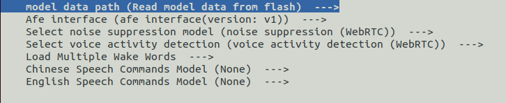

模型选择和加载
===========================

:link_to_translation:`en:[English]`

本文档解释了如何为ESP-SR选择和加载模型。

模型选择
---------------

ESP-SR允许您通过 ``menuconfig`` 界面选择所需的模型。要配置模型：

1. 运行 ``idf.py menuconfig``
2. 导航到 **ESP Speech Recognition**
3. 配置以下选项：
   - **噪声抑制模型**
   - **VAD模型**
   - **WakeNet模型**
   - **MultiNet模型**

更新分区表
------------------------
您必须添加一个 `partition.csv` 文件，并确保有足够的空间来存储所选的模型。
在项目的 ``partitions.csv`` 文件中添加以下行，以分配模型所需的空间：

.. code-block::

    model,  data,        ,         ,    6000K

- 将 ``6000K`` 替换为您根据所选模型自定义的分区大小。
- ``model`` 是分区标签（固定值）。

模型加载
-------------

ESP-IDF框架
~~~~~~~~~~~~~~~~~

ESP-SR通过其CMake脚本自动处理模型加载：

1. 烧写设备并包含所有组件：
   ``idf.py flash``
   *此命令会自动加载所选模型。*

2. 在代码调试时（不重新烧写模型）：
   ``idf.py app-flash``

.. note::  
   模型加载脚本在 ``esp-sr/CMakeLists.txt`` 中定义。模型在初始烧写时会被写入标签为 ``model`` 的分区。

Arduino框架
~~~~~~~~~~~~~~~~~

手动生成和加载模型：

1. 使用提供的Python脚本生成 ``srmodels.bin``：

   .. code-block:: bash

      python {esp-sr_path}/movemodel.py -d1 {sdkconfig_path} -d2 {esp-sr_path} -d3 {build_path}

   **参数：**

   - ``esp-sr_path``：您的ESP-SR组件目录路径
   - ``sdkconfig_path``：项目的 ``sdkconfig`` 文件路径
   - ``build_path``：项目的构建目录（通常是 ``your_project_path/build``）

2. 生成的 ``srmodels.bin`` 将位于：
   ``{build_path}/srmodels/srmodels.bin``

3. 将生成的二进制文件烧写到设备上。

.. important::  
   仅在 ``menuconfig`` 中更改模型配置后，请重新生成 ``srmodels.bin``。