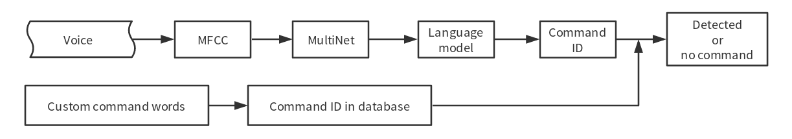

命令词
======

:link_to_translation:`en:[English]`

MultiNet 命令词识别模型
----------------------------

MultiNet 是为了在 {IDF_TARGET_NAME} 系列上离线实现多命令词识别而设计的轻量化模型，目前支持 200 个以内的自定义命令词识别。

.. list::

    :esp32s3: - 支持中文和英文命令词识别
    :esp32: - 支持中文命令词识别
    - 支持用户自定义命令词
    - 支持运行过程中 增加/删除/修改 命令词语
    - 最多支持 200 个命令词
    - 支持单次识别和连续识别两种模式
    - 轻量化，低资源消耗
    - 低延时，延时 500 ms内
    :esp32s3: - 支持在线中英文模型切换
    - 模型单独分区，支持用户应用 OTA

MultiNet 输入为经过前端语音算法（AFE）处理过的音频（格式为 16 KHz，16 bit，单声道）。通过对音频进行识别，则可以对应到相应的汉字或单词。

请参考 :doc:`Models Benchmark  <../benchmark/README>` 去查看当前不同芯片支持的模型。

用户选择不同的模型的方法请参考 :doc:`模型加载 <../flash_model/README>` 。

.. note::
    其中以 ``Q8`` 结尾的模型代表模型的 8 bit 版本，表明该模型更加轻量化。

命令词识别原理
-----------------

命令词识别原理如下图所示：

    speech_command-recognition-system

.. _command-requirements:

命令词格式要求
----------------

不同版本的MultiNet命令词格式不同。命令词需要满足特定的格式，具体如下：

    

自定义命令词方法
--------------------

.. note::
    不支持中英文混合

    不能含有阿拉伯数字和特殊字符

    英语自定义命令词方法请参考英文文档

MultiNet 支持多种且灵活的命令词设置方式，可通过在线或离线方法设置命令词，还允许随时动态增加/删除/修改命令词。

MultiNet5和MultiNet6使用汉语拼音作为基本识别单元。比如“打开空调”，应该写成 “da kai kong tiao”，请使用以下工具将汉字转为拼音： :project_file:`tool/multinet_pinyin.py` 。

MultiNet6 定义方法：
~~~~~~~~~~~~~~~~~~~~~~~~

- 中文通过修改  :project_file:`model/multinet_model/fst/commands_cn.txt`

    格式如下，第一个数字代表command id, 后面为指令的中文拼音，两者由空格隔开，拼音间也由空格隔开，Command id不能为0

    ::

        # command_id command_sentence
        1 da kai kong tiao
        2 guan bi kong tiao

MultiNet5 定义方法：
~~~~~~~~~~~~~~~~~~~~~~~~

-  通过 ``menuconfig``

    1. ``idf.py menuconfig`` > ``ESP Speech Recognition`` > ``Add Chinese speech commands/Add English speech commands``，添加命令词。具体也可参考 ESP-Skainet 中的 example。

    .. figure:: ../../_static/menuconfig_add_speech_commands.png
        :alt: menuconfig_add_speech_commands

        menuconfig_add_speech_commands

    注意，单个 Command ID 可以支持多个短语，比如“打开空调”和“开空调”表示的意义相同，则可以将其写在同一个 Command ID 对应的词条中，用英文字符“,”隔开相邻词条（“,”前后无需空格）。

    2. 在代码里调用以下 API：

    ::

        /**
        * @brief Update the speech commands of MultiNet by menuconfig
        *
        * @param multinet            The multinet handle
        *
        * @param model_data          The model object to query
        *
        * @param langugae            The language of MultiNet
        *
        * @return
        *     - ESP_OK                  Success
        *     - ESP_ERR_INVALID_STATE   Fail
        */
        esp_err_t esp_mn_commands_update_from_sdkconfig(esp_mn_iface_t *multinet, const model_iface_data_t *model_data);

通过调用 API 修改
~~~~~~~~~~~~~~~~~
指令还可以通过调用 API 修改，这种方法对于 MultiNet5 和 MultiNet6 都适用。

- 应用新的修改操作，所有添加、移除、修改及清空操作在调用后才会被应用。

    ::

        /**
        * @brief Update the speech commands of MultiNet
        * 
        * @Warning: Must be used after [add/remove/modify/clear] function, 
        *           otherwise the language model of multinet can not be updated.
        *
        * @return
        *     - NULL                 Success
        *     - others               The list of error phrase which can not be parsed by multinet.
        */
        esp_mn_error_t *esp_mn_commands_update();

- 添加一条新指令，如果指令格式不正确则返回 ``ESP_ERR_INVALID_STATE``。

    ::

        /**
        * @brief Add one speech commands with command string and command ID
        *
        * @param command_id      The command ID
        * @param string  The command string of the speech commands
        *
        * @return
        *     - ESP_OK                  Success
        *     - ESP_ERR_INVALID_STATE   Fail
        */
        esp_err_t esp_mn_commands_add(int command_id, char *string);

- 移除一条指令，如果该指令不存在则返回 ``ESP_ERR_INVALID_STATE``。

    ::

        /**
        * @brief Remove one speech commands by command string
        *
        * @param string  The command string of the speech commands
        *
        * @return
        *     - ESP_OK                  Success
        *     - ESP_ERR_INVALID_STATE   Fail
        */
        esp_err_t esp_mn_commands_remove(char *string);

- 修改一条指令，如果该指令不存在则返回 ``ESP_ERR_INVALID_STATE``。

    ::

        /**
        * @brief Modify one speech commands with new command string
        *
        * @param old_string  The old command string of the speech commands
        * @param new_string  The new command string of the speech commands
        *
        * @return
        *     - ESP_OK                  Success
        *     - ESP_ERR_INVALID_STATE   Fail
        */
        esp_err_t esp_mn_commands_modify(char *old_string, char *new_string);

- 清空所有指令。

    ::

        /**
        * @brief Clear all speech commands in linked list
        *
        * @return
        *     - ESP_OK                  Success
        *     - ESP_ERR_INVALID_STATE   Fail
        */
        esp_err_t esp_mn_commands_clear(void);

- 打印缓存的指令, 只有当调用 ``esp_mn_commands_update()`` 缓存指令才会被应用.

    ::

        /**
        * @brief Print all commands in linked list.
        */
        void esp_mn_commands_print(void);

- 打印当前已经被应用的指令.

    ::
        
        /**
        * @brief Print all commands in linked list.
        */
        void esp_mn_active_commands_print(void);
        
MultiNet 的使用
----------------

MultiNet 命令词识别建议和 ESP-SR 中的 AFE 声学算法模块一起运行，具体请参考 :doc:`AFE 介绍及使用 <../audio_front_end/README>` ）。

当用户配置完成 AFE 后，请按照以下步骤配置和运行 MultiNet。

MultiNet 初始化
~~~~~~~~~~~~~~~

-  模型加载与初始化，请参考 :doc:`模型加载 <../flash_model/README>`

-  设置命令词，请参考 :ref:`command-requirements`

MultiNet 运行
~~~~~~~~~~~~~

当用户开启 AFE 且使能 WakeNet 后，则可以运行 MultiNet。但需要注意以下几点要求：

* 传入帧长和 AFE fetch 帧长长度相等
* 支持音频格式为 16 KHz，16 bit，单通道。AFE fetch 拿到的数据也为这个格式

-  确定需要传入 MultiNet 的帧长

    ::

        int mu_chunksize = multinet->get_samp_chunksize(model_data);

    ``mu_chunksize`` 是需要传入 MultiNet 的每帧音频的 ``short`` 型点数，这个大小和 AFE 中 fetch 的每帧数据点数完全一致。

-  MultiNet 识别

    我们将 AFE 实时 ``fetch`` 到的数据送入以下 API：

    ::

        esp_mn_state_t mn_state = multinet->detect(model_data, buff);

    ``buff`` 的长度为 ``mu_chunksize * sizeof(int16_t)``。

MultiNet 识别结果
~~~~~~~~~~~~~~~~~

命令词识别必须和唤醒搭配使用，当唤醒后可以运行命令词的检测。

命令词模型在运行时，会实时返回当前帧的识别状态 ``mn_state`` ，目前分为以下几种识别状态：

-  ESP_MN_STATE_DETECTING

    该状态表示目前正在识别中，还未识别到目标命令词。

-  ESP_MN_STATE_DETECTED

    该状态表示目前识别到了目标命令词，此时用户可以调用 ``get_results`` 接口获取识别结果。

    ::

      esp_mn_results_t *mn_result = multinet->get_results(model_data);

    识别结果的信息存储在 ``get_result`` API 的返回值中，返回值的数据类型如下：

    ::

        typedef struct{
            esp_mn_state_t state;
            int num;                // The number of phrase in list, num<=5. When num=0, no phrase is recognized.
            int phrase_id[ESP_MN_RESULT_MAX_NUM];      // The list of phrase id.
            float prob[ESP_MN_RESULT_MAX_NUM];         // The list of probability.
        } esp_mn_results_t;

    其中，

    -  ``state`` 为当前识别的状态
    -  ``num`` 表示识别到的词条数目， ``num`` <= 5，即最多返回 5 个候选结果
    -  ``phrase_id`` 表示识别到的词条对应的 Phrase ID
    -  ``prob`` 表示识别到的词条识别概率，从大到到小依次排列

    用户可以使用 ``phrase_id[0]`` 和 ``prob[0]`` 拿到概率最高的识别结果。

-  ESP_MN_STATE_TIMEOUT

    该状态表示长时间未检测到命令词，自动退出。等待下次唤醒。

单次识别模式和连续识别模式：
当命令词识别返回状态为 ``ESP_MN_STATE_DETECTED`` 时退出命令词识别，则为单次识别模式；
当命令词识别返回状态为 ``ESP_MN_STATE_TIMEOUT`` 时退出命令词识别，则为连续识别模式；

资源消耗
--------

有关本模型的资源消耗情况，请见 :doc:`资源消耗 <../benchmark/README>`。
