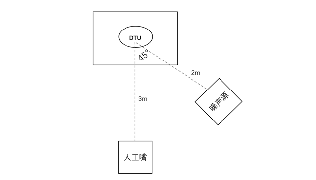

测试方法与测试报告
==================

:link_to_translation:`en:[English]`

测试场景
~~~~~~~~

* 房间大小

    * 地面大小: 至少 4M*3.2M

    * 高度至少: 2.30M

* 房间装饰

    * 地板需配有地毯，在天花板上配备一些通常在办公室中常见的声学阻尼。在1到2面墙上挂有窗帘，防止强反射。

    * 房间混响（RT601）在[125, 8k]范围内，要满足0.2-0.7s的要求。

    * 不要使用消音室。

* 环境底噪要求：应该 < 35dBA，最好是 < 30dBA。

* 温度和湿度要求：70+-20 华氏度，相对湿度为50%+-20%。

* 设备位置

    * 根据产品可能的实际使用方式，确定设备在性能测试时摆放的位置，比如设 备高度、离墙的距离、离地面的距离、角度等。

* 外噪的角度、距离、高度和分贝

    * 外噪到设备麦克的角度、距离，外噪距离地面的高度， 在设备麦克处测量到的外噪分贝值。

* 人声的角度、高度、距离和分贝

    * 性能测试时播放的测试语音集称为人声。人声到设备 麦克的角度、距离，人声距离地面的高度，在设备麦克处测量到的人声分贝值。

在不同的测试场景中，RT60、房间底噪、设备的位置是三个通用因素，在这些因素被确定之后，将被运用到不同的测试场景中。

唤醒率测试
~~~~~~~~~~

唤醒率测试是指当设备处于待唤醒状态时被唤醒成功的概率。

除通用因素外，通常唤醒率测试还需要确定的因素如表 1 所示。可以根据产品定位设计噪声和人声相对设备同向或者不同向的测试场景，或者多噪声源的测试场景，以及不同的 SNR 场景。

+--------------+----------+----------+----------+----------+----------+----------+------+
| 测试场景编号 | 外噪距离 | 外噪角度 | 外噪分贝 | 人声距离 | 人声角度 | 人声分贝 | SNR  |
+==============+==========+==========+==========+==========+==========+==========+======+
| 1            | /        | /        | <35dBA   | 3m       | 90°      | 54dBA    | /    |
+--------------+----------+----------+----------+----------+----------+----------+------+
| 2            | 2m       | 45°      | 45dBA    | 3m       | 90°      | 54dBA    | 9dB  |
+--------------+----------+----------+----------+----------+----------+----------+------+
| 3            | 2m       | 45°      | 55dBA    | 3m       | 90°      | 59dBA    | 4dB  |
+--------------+----------+----------+----------+----------+----------+----------+------+
| 4            | 2m       | 45°      | 65dBA    | 3m       | 90°      | 64dBA    | -1dB |
+--------------+----------+----------+----------+----------+----------+----------+------+

.. figure:: ../../_static/test_reference_position1.png
    :align: center
    :alt: overview

描述已自动生成在唤醒测试场景下，建议人工嘴（声音源）位于语音模块麦克风正前方，水平直线距离3米，人工嘴（声音源）距离地面1.5米。语音模块（ESP32-S3）和声压计位于同一垂直方向，声压计在语音模块（ESP32-S3）正上方75厘米处。噪声源在斜45度方向，距地高度1.2米，距离语音模块（ESP32-S3）2米。

识别测试
~~~~~~~~

识别率测试是指当设备处于识别状态时成功识别词表里包含的命令词的概率。

除通用因素外，通常识别率测试还需要确定的因素如下表所示。同唤醒率测试一样，识别率测试也可以根据产品定位去设计多样的测试场景。

+--------------+----------+----------+----------+----------+----------+----------+------+
| 测试场景编号 | 外噪距离 | 外噪角度 | 外噪分贝 | 人声距离 | 人声角度 | 人声分贝 | SNR  |
+==============+==========+==========+==========+==========+==========+==========+======+
| 1            | /        | /        | <35dBA   | 3m       | 90°      | 54dBA    | /    |
+--------------+----------+----------+----------+----------+----------+----------+------+
| 2            | 2m       | 45°      | 45dBA    | 3m       | 90°      | 54dBA    | 9dB  |
+--------------+----------+----------+----------+----------+----------+----------+------+
| 3            | 2m       | 45°      | 55dBA    | 3m       | 90°      | 59dBA    | 4dB  |
+--------------+----------+----------+----------+----------+----------+----------+------+
| 4            | 2m       | 45°      | 65dBA    | 3m       | 90°      | 64dBA    | -1dB |
+--------------+----------+----------+----------+----------+----------+----------+------+

误唤醒测试
~~~~~~~~~~

误唤醒率测试是指设备在产品定义的应用场景下被非唤醒词成功唤醒的概率。需要根据产品定义的应用场景中，设备可能处于的环境来设计误唤醒的测试场景，比如在家居应用场景 中，设备可能处于安静、外噪、设备自噪等环境。 

除通用因素外，通常误唤醒率测试还需要确定的因素如下表所示。误唤醒率一般采用的衡量单位为次/小时。 

+--------------+----------+----------+----------+----------+----------+
| 测试场景编号 | 噪声类型 | 噪声距离 | 噪声角度 | 噪声分贝 | 测试时长 |
+==============+==========+==========+==========+==========+==========+
| 1            | 安静     | /        | /        | <35dBA   | 24小时   |
+--------------+----------+----------+----------+----------+----------+
| 2            | 白噪声   | 2m       | 45°      | 65dBA    | 24小时   |
+--------------+----------+----------+----------+----------+----------+
| 3            | 新闻     | 2m       | 45°      | 65dBA    | 24小时   |
+--------------+----------+----------+----------+----------+----------+
| 4            | 酒吧     | 2m       | 45°      | <65dBA   | 24小时   |
+--------------+----------+----------+----------+----------+----------+

唤醒打断率测试
~~~~~~~~~~~~~~

对于有 AEC 功能的产品，通常还需要测试唤醒打断率。唤醒打断率是指设备有自噪时， 即有 TTS3 播报或播放音频时，被唤醒成功的概率。 

除通用因素外，通常唤醒打断率测试还需要确定的因素如下表所示。

+--------------+--------------+----------+----------+----------+----------+
| 测试场景编号 | 设备自噪类型 | 噪声分贝 | 人声距离 | 人声角度 | 人声分贝 |
+==============+==============+==========+==========+==========+==========+
| 1            | 音乐         | 65dB     | 3米      | 90°      | 64dB     |
+--------------+--------------+----------+----------+----------+----------+
| 2            | TTS          | 65dB     | 3米      | 90°      | 64dB     |
+--------------+--------------+----------+----------+----------+----------+

响应时间测试
~~~~~~~~~~~~
搭建好测试环境，打开语音录制工具，播放测试机，播报完毕后，利用语音录制工具计算出语音指令与播报之间的时间间隔即为响应时间。 

步骤： 

    #. 利用人工嘴播放测试集。 

    #. 记录测试数据。 

    #. 计算相应时间。

乐鑫语音测试结果
~~~~~~~~~~~~~~~~

唤醒率测试
-----------

+----------------+------------+-------------+-----------+-----------+-----------+--------+--------+
| 测试项         | 环境噪声   | 噪声指标    | 信噪比SNR | 角度      | 距离      | 唤醒率 | 识别率 |
+================+============+=============+===========+===========+===========+========+========+
| 本地唤醒率测试 | 安静       | 人声：59dBA | NA        | 人声：90° | 人声：3米 | 99%    | 91.5%  |
|                |            |             |           |           |           |        |        |
|                |            | 噪声：NA    |           | 噪声：45° | 噪声：2米 |        |        |
|                +------------+-------------+-----------+           |           +--------+--------+
|                | 白噪声     | 人声：59dBA | ≥4dBA     |           |           | 99%    | 78.25% |
|                |            |             |           |           |           |        |        |
|                |            | 噪声：55dBA |           |           |           |        |        |
|                +------------+-------------+-----------+           |           +--------+--------+
|                | 人声类噪声 | 人声：59dBA | ≥4dBA     |           |           | 99%    | 82.77% |
|                |            |             |           |           |           |        |        |
|                |            | 噪声：55dBA |           |           |           |        |        |
+----------------+------------+-------------+-----------+-----------+-----------+--------+--------+

误唤醒测试
-----------

+------------+----------+-------------+----------+------------+
|   测试项   | 环境噪声 |  噪声指标   | 测试时间 | 误唤醒次数 |
+============+==========+=============+==========+============+
| 误唤醒测试 | 音乐     | 噪声：55dBA | 12h      | 1          |
|            +----------+-------------+----------+------------+
|            | 新闻     | 噪声：55dBA | 12h      | 1          |
+------------+----------+-------------+----------+------------+

唤醒打断率测试
--------------

+----------------+----------+---------------+-----------+--------+--------------+
|     测试项     | 环境噪声 |   噪声指标    | 信噪比SNR | 唤醒率 | 命令词识别率 |
+================+==========+===============+===========+========+==============+
| 唤醒打断率测试 | 音乐     | 人声59dBA     | ≥ 10dBA   | 100%   | 96%          |
|                |          | 噪声69dBA     |           |        |              |
|                +----------+---------------+-----------+--------+--------------+
|                | TTS      | 人声：59dBA   | ≥ 10dBA   | 100%   | 96%          |
|                |          | 噪声：69dBA   |           |        |              |
+----------------+----------+---------------+-----------+--------+--------------+

响应时间测试
------------

+--------------+----------+---------------+------------+----------+
|    测试项    | 环境噪声 |   噪声指标    | 信噪比 SNR | 响应时间 |
+==============+==========+===============+============+==========+
| 响应时间测试 | 安静     | 人声：59dBA   | NA         | <500 ms  |
|              |          | 噪声：NA      |            |          |
+--------------+----------+---------------+------------+----------+

.. figure:: ../../_static/test_response_time.png
    :align: center
    :alt: overview