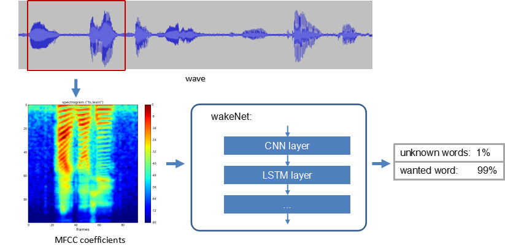

WakeNet 唤醒词模型
===================

:link_to_translation:`en:[English]`

WakeNet 是一个基于神经网络，为低功耗嵌入式 MCU 设计的唤醒词模型，目前支持 5 个以内的唤醒词识别。

概述
----

WakeNet 的流程图如下：

.. raw:: html

    

.. raw:: html

    

-  语音特征 (Speech Feature)
    我们使用 `MFCC <https://en.wikipedia.org/wiki/Mel-frequency_cepstrum>`__ 方法提取语音频谱特征。输入的音频文件采样率为 16 KHz，单声道，编码方式为 signed 16-bit。每帧窗宽和步长均为 30 ms。

.. only:: latex

    .. figure:: ../../_static/QR_MFCC.png
        :alt: overview

-  神经网络 (Neural Network)
    神经网络结构已经更新到第 9 版，其中：

    -  WakeNet1、WakeNet2、WakeNet3、WakeNet4、WakeNet6 and WakeNet7 已经停止使用。
    -  WakeNet5 应用于 ESP32 芯片。
    -  WakeNet8 和 WakeNet9 应用于 ESP32-S3 芯片，模型基于 `Dilated Convolution <https://arxiv.org/pdf/1609.03499.pdf>`__ 结构。

.. only:: latex

    .. figure:: ../../_static/QR_Dilated_Convolution.png
        :alt: overview

    注意，WakeNet5、WakeNet5X2 和 WakeNet5X3 的网络结构一致，但是 WakeNet5X2 和 WakeNet5X3 的参数比 WakeNet5 要多。请参考 :doc:`资源消耗 <../benchmark/README>` 来获取更多细节。

-  Keyword Trigger Method
    对连续的音频流，为准确判断关键词的触发，我们通过计算若干帧内识别结果的平均值 M，来判断是否触发。当 M 大于指定阈值，则发出触发的命令。

以下表格展示在不同芯片上的模型支持：

.. _esp-open-wake-word:

+-----------------+-----------+-------------+-------------+-----------+-----------+-----------+-----------+
| Chip            | ESP32                                 | ESP32S3                                       |
+=================+===========+=============+=============+===========+===========+===========+===========+
| model           | WakeNet 5                             | WakeNet 8             | WakeNet 9             |
|                 +-----------+-------------+-------------+-----------+-----------+-----------+-----------+
|                 | WakeNet 5 | WakeNet 5X2 | WakeNet 5X3 | Q16       | Q8        | Q16       | Q8        |
+-----------------+-----------+-------------+-------------+-----------+-----------+-----------+-----------+
| Hi,Lexin        | √         | √           | √           |           |           |           | √         |
+-----------------+-----------+-------------+-------------+-----------+-----------+-----------+-----------+
| nihaoxiaozhi    | √         |             | √           |           |           |           | √         |
+-----------------+-----------+-------------+-------------+-----------+-----------+-----------+-----------+
| nihaoxiaoxin    |           |             | √           |           |           |           |           |
+-----------------+-----------+-------------+-------------+-----------+-----------+-----------+-----------+
| xiaoaitongxue   |           |             |             |           |           |           | √         |
+-----------------+-----------+-------------+-------------+-----------+-----------+-----------+-----------+
| Alexa           |           |             |             | √         |           |           | √         |
+-----------------+-----------+-------------+-------------+-----------+-----------+-----------+-----------+
| Hi,ESP          |           |             |             |           |           |           | √         |
+-----------------+-----------+-------------+-------------+-----------+-----------+-----------+-----------+
| Customized word |           |             |             |           |           |           | √         |
+-----------------+-----------+-------------+-------------+-----------+-----------+-----------+-----------+

WakeNet 的使用
---------------

-  WakeNet 模型选择

    WakeNet 模型选择请参考 :doc:`flash model 介绍 <../flash_model/README>` 。

    自定义的唤醒词，请参考 :doc:`乐鑫语音唤醒词定制流程 <ESP_Wake_Words_Customization>` 。

-  WakeNet 模型运行

    WakeNet 目前包含在语音前端算法 :doc:`AFE <../audio_front_end/README>` 中，默认为运行状态，并将识别结果通过 AFE fetch 接口返回。

    如果用户无需使用 WakeNet 唤醒，请在 AFE 配置时选择：

    ::

        afe_config.wakenet_init = False.

    如果用户想临时关闭/打开 WakeNet, 请在运行过程中调用：

    ::

        afe_handle->disable_wakenet(afe_data)
        afe_handle->enable_wakenet(afe_data)

资源消耗
--------

有关本模型的资源消耗情况，请见 :doc:`资源消耗 <../benchmark/README>`。